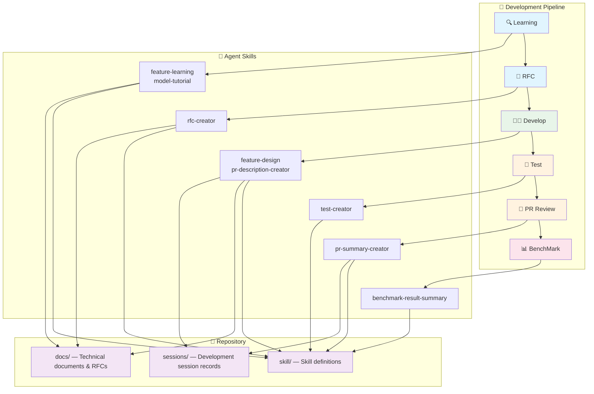
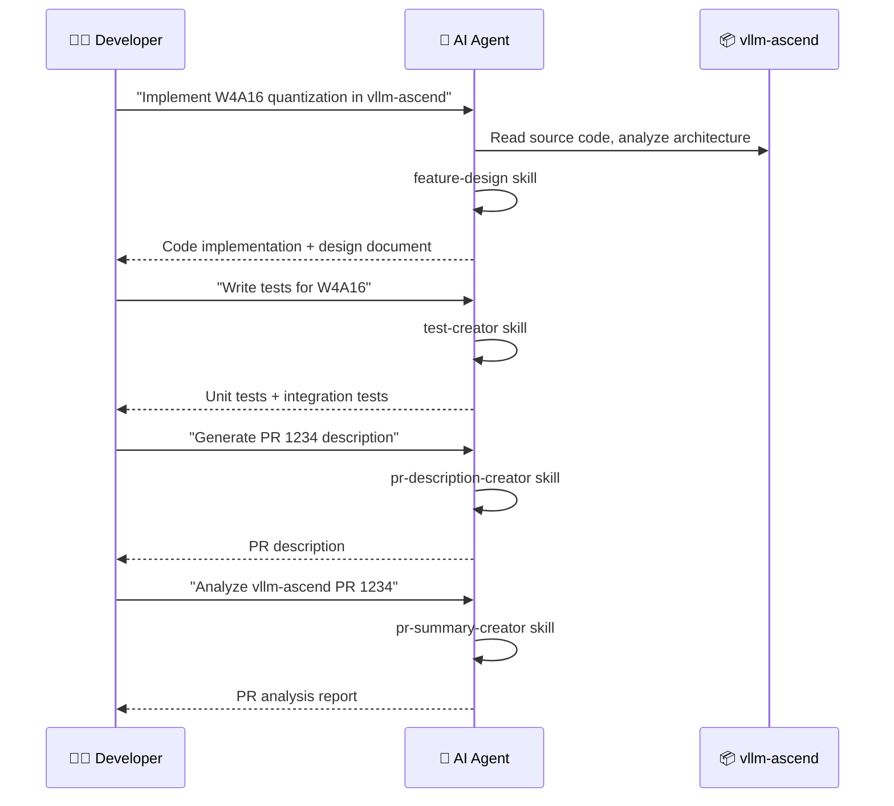

# vllm-ascend-workflow

<div align='left'>
  <a href="https://github.com/vllm-project/vllm-ascend"></a>
  
  
  
  
  
  
  
  
</div>

<p align="center">
  <strong>English</strong> | <a href="README.zh-CN.md">简体中文</a>
</p>

## 📌 Overview

[vllm-ascend-workflow](https://github.com/Xigorithm/vllm-ascend-workflow) is an **AI-assisted development workflow repository** for [vllm-ascend](https://github.com/vllm-project/vllm-ascend) (vLLM Ascend NPU plugin), powered by [OpenCode](https://opencode.ai) Agent Skills.

This repository covers the full vllm-ascend development pipeline — **Learning → RFC → Develop → Test → PR Review → BenchMark** — mapping each stage to specialized Agent Skills and repository directories:



---

## 🏗️ Repository Structure

```
vllm-ascend-workflow/
├── skill/                  # Agent Skills — reusable AI coding skills
│   ├── feature-design.skill
│   ├── feature-learning.skill
│   ├── model-tutorial.skill
│   ├── pr-description-creator.skill
│   ├── pr-summary-creator.skill
│   ├── rfc-creator.skill
│   ├── test-creator.skill
│   └── benchmark-result-summary.skill
├── docs/                   # Technical documents — feature analysis & design proposals
│   ├── quantization.md                    # Quantization feature deep-dive
│   ├── design-quantization-refactor.md    # Quantization refactoring design document
│   └── rfc-quantization-code-refactoring.md  # Quantization refactoring RFC
└── sessions/               # Session records — full development interaction logs
    └── session-quantization-refactor.md   # Quantization refactoring session
```

---

## 🚀 Agent Skills

Agent Skills define specialized workflows that turn an AI coding assistant into a vllm-ascend domain expert. Each skill is a self-contained `.skill` package containing prompt templates, reference materials, and output specifications.

### 🔍 Code Learning

| Skill | Description | Trigger Example |
|:------|:------------|:----------------|
| **feature-learning** | Generate comprehensive Chinese technical learning documents with Mermaid architecture diagrams, GPU-vs-NPU comparisons, and source code walkthroughs | `我想了解 vllm-ascend 的量化特性` |
| **model-tutorial** | Generate Chinese technical tutorial documents for specific models running on Ascend NPU | `帮我生成 DeepSeek-V3 在昇腾上的模型教程` |

### 🧑‍💻 Feature Development

| Skill | Description | Trigger Example |
|:------|:------------|:----------------|
| **feature-design** | Design and implement vllm-ascend features with code implementation and Chinese technical design documents | `帮我在 vllm-ascend 中实现 W4A16 量化` |
| **rfc-creator** | Generate vllm-ascend style RFC documents for major architectural change proposals | `帮我生成一个 vllm-ascend RFC` |
| **pr-description-creator** | Generate vllm-ascend style PR descriptions (Purpose / Test Plan / Test Result) from GitHub PR code changes | `帮我生成 vllm-ascend PR 1234 的描述` |

### 🧪 Testing

| Skill | Description | Trigger Example |
|:------|:------------|:----------------|
| **test-creator** | Generate unit tests and integration tests for the vllm-ascend repository | `帮我写 vllm-ascend 中 XXX 的测试用例` |

### 🔎 Code Review

| Skill | Description | Trigger Example |
|:------|:------------|:----------------|
| **pr-summary-creator** | Fetch and deeply analyze vllm-ascend PRs, generating comprehensive reports with code change analysis, Mermaid architecture diagrams, and risk assessment | `帮我分析 vllm-ascend PR 1234` |

### 📊 Performance Analysis

| Skill | Description | Trigger Example |
|:------|:------------|:----------------|
| **benchmark-result-summary** | Compare vllm-ascend serving benchmark outputs before and after a code change with percentage change analysis | *(Paste benchmark output and ask to compare)* |

---

## 🔄 Typical Workflow

Below illustrates a complete **Feature Development → PR Submission → Code Review** workflow:



---

## 📚 Technical Documents (Docs)

Technical documents summarizing feature insights, design decisions, and engineering experience, assisted by Agent Skills.

| Document | Type | Description |
|:---------|:-----|:------------|
| [quantization.md](./docs/quantization.md) | Feature Learning | Deep-dive into vLLM Ascend quantization: plugin registration, config parsing, NPU implementation for each quantization method |
| [design-quantization-refactor.md](./docs/design-quantization-refactor.md) | Design Document | Quantization code refactoring design: eliminating MoE redundancy, unifying weight processing, simplifying 310P registry |
| [rfc-quantization-code-refactoring.md](./docs/rfc-quantization-code-refactoring.md) | RFC | Quantization code refactoring RFC: architectural change proposal for improved maintainability and usability |

> 💡 **Contribute docs**: Use `feature-learning` or `feature-design` skill to generate documents, then submit to the appropriate `docs/` subdirectory.

---

## 📝 Session Records (Sessions)

Key development session records capturing the full interaction between developers and AI agents — from problem analysis and solution design to code changes and lessons learned.

| Session | Description |
|:--------|:------------|
| [session-quantization-refactor.md](./sessions/session-quantization-refactor.md) | Quantization feature principles and code implementation: a complete development session from feature learning to refactoring design |

> 💡 **Share sessions**: Export key sessions to `sessions/` with descriptive filenames (e.g., `session-<topic>.md`).

---

## ⚡ Quick Start

### Prerequisites

- Install [OpenCode](https://opencode.ai) (AI coding assistant)
- Configure an LLM Provider API Key (e.g., Claude, GPT, etc.)
- Clone [vllm-ascend](https://github.com/vllm-project/vllm-ascend) locally (for source code walkthrough and code analysis)

### Installation

**1. Clone this repository**

```bash
git clone https://github.com/Xigorithm/vllm-ascend-workflow.git
cd vllm-ascend-workflow
```

**2. Configure OpenCode Skills Path**

Create or edit `opencode.json` in your vllm-ascend project root:

```json
{
  "skills": {
    "paths": ["<path-to>/vllm-ascend-workflow/skill"]
  }
}
```

**3. Start Using**

Enter trigger commands directly in OpenCode:

```
> 我想了解 vllm-ascend 的 ACL Graph
> 帮我在 vllm-ascend 中实现 W4A16 量化
> 帮我分析 vllm-ascend PR 1234
```

---

## 🛠️ Related Resources

- [vllm-ascend](https://github.com/vllm-project/vllm-ascend) — vLLM Ascend NPU plugin main repository
- [vllm-dev-skills](https://github.com/Xigorithm/vllm-dev-skills) — vLLM general Agent Skills collection (inspiration for this project)
- [OpenCode](https://opencode.ai) — AI coding assistant
- [Agent Skills Specification](https://agentskills.io/home#why-agent-skills) — Agent Skills standards and best practices
- [vLLM Documentation](https://docs.vllm.ai/) — vLLM inference engine documentation

---

## 🤝 Contributing

Contributions are welcome! Here are ways to get involved:

| Contribution Type | How |
|:------------------|:----|
| **Add a Skill** | Create a `.skill` file under `skill/` following OpenCode Skill conventions |
| **Add a Document** | Use a Skill to generate docs, submit to the appropriate `docs/` subdirectory |
| **Share a Session** | Export a key session to `sessions/` with a descriptive filename |
| **Improve Existing** | Suggest improvements or submit PRs for existing Skills / Docs / Sessions |

---

## ©️ Citation

```bibtex
@misc{vllm-ascend-workflow@2026,
  title  = {vllm-ascend-workflow},
  url    = {https://github.com/Xigorithm/vllm-ascend-workflow},
  note   = {AI-assisted development workflow for vllm-ascend},
  author = {Xigorithm},
  year   = {2026}
}
```

---

## 📜 License

Same as [vllm-ascend](https://github.com/vllm-project/vllm-ascend) (Apache-2.0).

