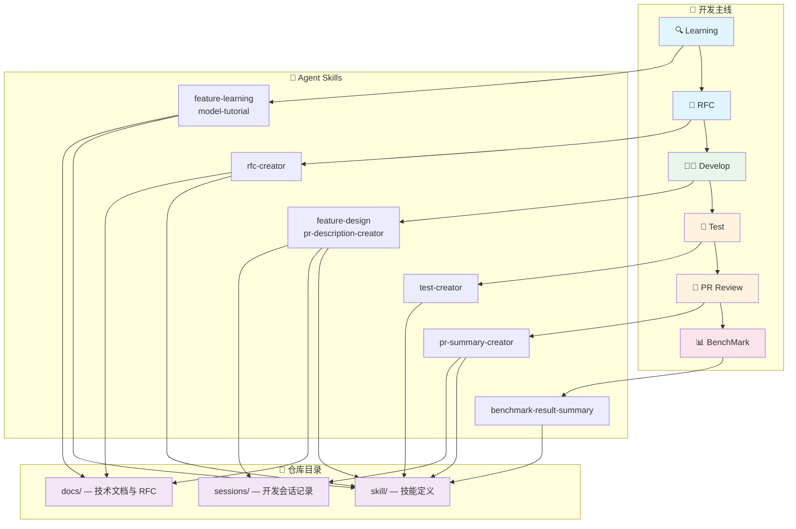
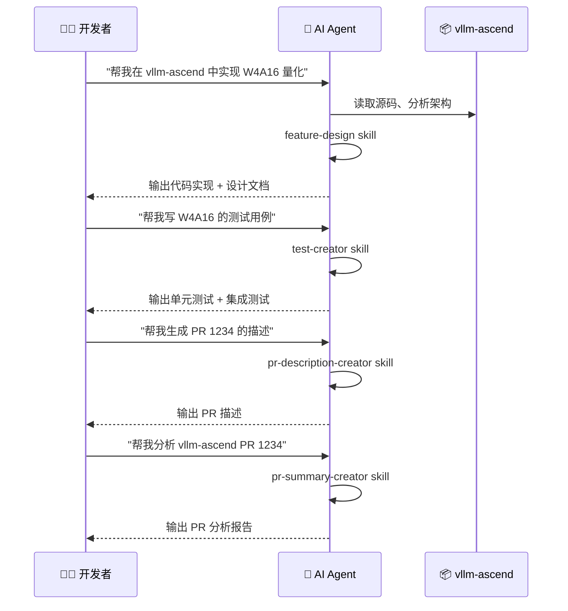

# vllm-ascend-workflow

<div align='left'>
  <a href="https://github.com/vllm-project/vllm-ascend"></a>
  
  
  
  
  
  
  
  
</div>

<p align="center">
  <a href="README.md">English</a> | <strong>简体中文</strong>
</p>

## 📌 概述

[vllm-ascend-workflow](https://github.com/Xigorithm/vllm-ascend-workflow) 是 [vllm-ascend](https://github.com/vllm-project/vllm-ascend)（vLLM Ascend NPU 插件）的 **AI 辅助开发工作流仓库**，基于 [OpenCode](https://opencode.ai) Agent Skills 构建。

本仓库覆盖 vllm-ascend 完整开发主线 —— **Learning → RFC → Develop → Test → PR Review → BenchMark** —— 将每个阶段映射到专业的 Agent Skills 和仓库目录：



---

## 🏗️ 仓库结构

```
vllm-ascend-workflow/
├── skill/                  # Agent Skills — 可复用的 AI 编码技能
│   ├── feature-design.skill
│   ├── feature-learning.skill
│   ├── model-tutorial.skill
│   ├── pr-description-creator.skill
│   ├── pr-summary-creator.skill
│   ├── rfc-creator.skill
│   ├── test-creator.skill
│   └── benchmark-result-summary.skill
├── docs/                   # 技术文档 — 特性分析与设计方案
│   ├── quantization.md                    # 量化特性学习文档
│   ├── design-quantization-refactor.md    # 量化代码重构设计文档
│   └── rfc-quantization-code-refactoring.md  # 量化代码重构 RFC
└── sessions/               # 会话记录 — 开发过程完整记录
    └── session-quantization-refactor.md   # 量化重构会话记录
```

---

## 🚀 Agent Skills

Agent Skills 定义专业工作流，将 AI 编码助手转变为 vllm-ascend 领域专家。每个 Skill 是一个自包含的 `.skill` 包，包含提示词模板、参考资料和输出规范。

### 🔍 代码学习

| Skill | 说明 | 触发示例 |
|:------|:-----|:---------|
| **feature-learning** | 生成中文技术学习文档，包含 Mermaid 架构图、GPU vs NPU 对比分析、源码逐行走读 | `我想了解 vllm-ascend 的量化特性` |
| **model-tutorial** | 生成特定模型在昇腾 NPU 上运行的中文技术教程文档 | `帮我生成 DeepSeek-V3 在昇腾上的模型教程` |

### 🧑‍💻 特性开发

| Skill | 说明 | 触发示例 |
|:------|:-----|:---------|
| **feature-design** | 设计并实现 vllm-ascend 特性，产出代码实现和中文技术设计文档 | `帮我在 vllm-ascend 中实现 W4A16 量化` |
| **rfc-creator** | 生成 vllm-ascend 风格 RFC 文档，用于重大架构变更提案 | `帮我生成一个 vllm-ascend RFC` |
| **pr-description-creator** | 从 GitHub PR 代码变更自动生成 vllm-ascend 风格 PR 描述（Purpose / Test Plan / Test Result） | `帮我生成 vllm-ascend PR 1234 的描述` |

### 🧪 测试

| Skill | 说明 | 触发示例 |
|:------|:-----|:---------|
| **test-creator** | 为 vllm-ascend 仓库生成单元测试和集成测试 | `帮我写 vllm-ascend 中 XXX 的测试用例` |

### 🔎 代码审查

| Skill | 说明 | 触发示例 |
|:------|:-----|:---------|
| **pr-summary-creator** | 获取并深度分析 vllm-ascend PR，生成包含代码变更分析、Mermaid 架构图和风险评估的完整报告 | `帮我分析 vllm-ascend PR 1234` |

### 📊 性能分析

| Skill | 说明 | 触发示例 |
|:------|:-----|:---------|
| **benchmark-result-summary** | 对比代码变更前后的 vllm-ascend 服务基准测试输出，含百分比变化分析 | *(粘贴基准测试输出并要求对比)* |

---

## 🔄 典型工作流

以下展示一个完整的 **特性开发 → PR 提交 → 代码审查** 工作流：



---

## 📚 技术文档 (Docs)

技术文档总结特性洞察、设计决策和工程经验，由 Agent Skills 辅助生成。

| 文档 | 类型 | 说明 |
|:-----|:-----|:-----|
| [quantization.md](./docs/quantization.md) | 特性学习 | vLLM Ascend 量化特性深入分析：插件注册、配置解析、各量化方法的 NPU 实现 |
| [design-quantization-refactor.md](./docs/design-quantization-refactor.md) | 设计文档 | 量化代码重构设计：消除 MoE 冗余、统一权重处理、简化 310P 注册 |
| [rfc-quantization-code-refactoring.md](./docs/rfc-quantization-code-refactoring.md) | RFC | 量化代码重构 RFC：提升可维护性和易用性的架构变更提案 |

> 💡 **贡献文档**：使用 `feature-learning` 或 `feature-design` skill 生成文档，提交到 `docs/` 对应子目录。

---

## 📝 会话记录 (Sessions)

关键开发 Session 记录，保留开发者与 AI Agent 的完整交互过程——从问题分析、方案设计到代码变更和经验教训。

| 会话 | 说明 |
|:-----|:-----|
| [session-quantization-refactor.md](./sessions/session-quantization-refactor.md) | 量化特性原理与代码实现全流程：从特性学习到重构设计的完整开发会话 |

> 💡 **分享会话**：导出关键 Session 到 `sessions/`，使用描述性文件名（如 `session-<topic>.md`）。

---

## ⚡ 快速开始

### 前提条件

- 安装 [OpenCode](https://opencode.ai)（AI 编码助手）
- 配置 LLM Provider API Key（如 Claude、GPT 等）
- 本地克隆 [vllm-ascend](https://github.com/vllm-project/vllm-ascend) 仓库（用于源码走读和代码分析）

### 安装配置

**1. 克隆本仓库**

```bash
git clone https://github.com/Xigorithm/vllm-ascend-workflow.git
cd vllm-ascend-workflow
```

**2. 配置 OpenCode Skills 路径**

在 vllm-ascend 项目根目录创建或编辑 `opencode.json`：

```json
{
  "skills": {
    "paths": ["<path-to>/vllm-ascend-workflow/skill"]
  }
}
```

**3. 开始使用**

在 OpenCode 中直接输入触发指令即可：

```
> 我想了解 vllm-ascend 的 ACL Graph
> 帮我在 vllm-ascend 中实现 W4A16 量化
> 帮我分析 vllm-ascend PR 1234
```

---

## 🛠️ 相关资源

- [vllm-ascend](https://github.com/vllm-project/vllm-ascend) — vLLM Ascend NPU 插件主仓库
- [vllm-dev-skills](https://github.com/Xigorithm/vllm-dev-skills) — vLLM 通用 Agent Skills 集合（本项目的灵感来源）
- [OpenCode](https://opencode.ai) — AI 编码助手
- [Agent Skills 规范](https://agentskills.io/home#why-agent-skills) — Agent Skills 标准与最佳实践
- [vLLM 官方文档](https://docs.vllm.ai/) — vLLM 推理引擎文档

---

## 🤝 贡献指南

欢迎贡献！以下是几种参与方式：

| 贡献类型 | 操作 |
|:---------|:-----|
| **新增 Skill** | 在 `skill/` 下创建 `.skill` 文件，按 OpenCode Skill 规范编写 |
| **新增文档** | 使用 Skill 生成文档，输出到对应的 `docs/` 子目录 |
| **分享 Session** | 导出关键 Session 到 `sessions/`，使用描述性文件名 |
| **改进现有内容** | 对已有 Skill / Doc / Session 提出改进建议或直接提交 PR |

---

## ©️ 引用

```bibtex
@misc{vllm-ascend-workflow@2026,
  title  = {vllm-ascend-workflow},
  url    = {https://github.com/Xigorithm/vllm-ascend-workflow},
  note   = {AI-assisted development workflow for vllm-ascend},
  author = {Xigorithm},
  year   = {2026}
}
```

---

## 📜 许可证

与 [vllm-ascend](https://github.com/vllm-project/vllm-ascend) 相同（Apache-2.0）。

