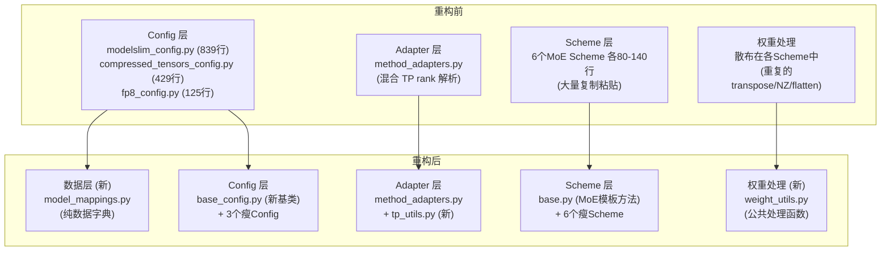
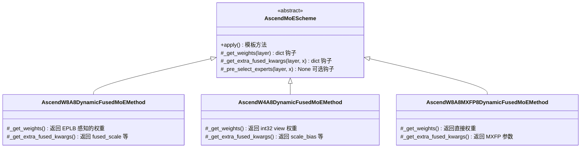
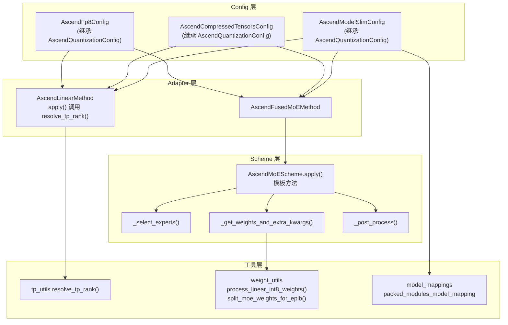
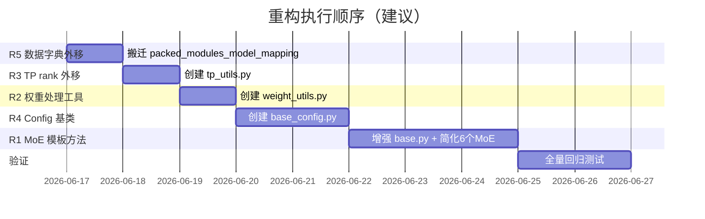

# vLLM Ascend 量化代码重构设计文档

> **文档版本**: 1.0
> **分析代码版本**: vllm-ascend main 分支（截至 2026-06）
> **最后更新**: 2026-06-16

---

## 1. 问题分析

### 1.1 现状总览

当前 `vllm_ascend/quantization/` 目录共 **17 个文件、约 4500+ 行代码**，存在以下核心问题：

| 问题 | 影响范围 | 冗余行数（估算） |
|------|---------|:--------------:|
| MoE `apply()` 方法大量复制粘贴 | 6 个 MoE Scheme | ~240 行 |
| 3 个 Config 类重复 dispatch 逻辑 | 3 个 Config 文件 | ~83 行 |
| 权重后处理模式重复 | 10 个 `process_weights_after_loading` | ~88 行 |
| Adapter 混入 TP rank 解析逻辑 | `method_adapters.py` | ~16 行（但增加理解复杂度） |
| `modelslim_config.py` 臃肿 | 单文件 839 行 | 数据字典 ~210 行 |
| **合计可消除冗余** | | **~430 行** |

### 1.2 问题一：MoE apply() 六处复制

6 个 MoE Scheme 的 `apply()` 方法共享完全相同的骨架流程（约 40 行），但每个文件都完整复制了一遍：

```
expert 数量解析 → select_experts() → force_load_balance → dtype cast → fused_experts()
```

**各文件 apply() 行数**：

| 文件 | 类名 | apply() 行数 | 独有逻辑行数 |
|------|------|:----------:|:----------:|
| `w8a8_dynamic.py` | `AscendW8A8DynamicFusedMoEMethod` | 138 | ~50 |
| `w4a8.py` | `AscendW4A8DynamicFusedMoEMethod` | 106 | ~30 |
| `w8a8_mxfp8.py` | `AscendW8A8MXFP8DynamicFusedMoEMethod` | 98 | ~20 |
| `w4a4_mxfp4.py` | `AscendW4A4MXFP4DynamicFusedMoEMethod` | 86 | ~10 |
| `w4a16.py` | `AscendW4A16FusedMoEMethod` | 83 | ~10 |
| `w4a8_mxfp4.py` | `AscendW4A8MXFPDynamicFusedMoEMethod` | 88 | ~10 |
| **合计** | | **599** | **~130** |

**599 行中约 240 行是纯复制**（40 行 × 6 份）。

### 1.3 问题二：Config 类 dispatch 重复

三个 Config 类的 `get_quant_method()` 共享相同的 isinstance 分支模式：

```python
# 三个 Config 都在做类似的事：
if isinstance(layer, LinearBase):
    scheme = create_scheme(...)
    return AscendLinearMethod(scheme)
if isinstance(layer, FusedMoE):
    scheme = create_scheme(...)
    return AscendFusedMoEMethod(scheme, moe_config, tid2eid)
return None
```

### 1.4 问题三：权重后处理重复

4 个 Linear Scheme 共享完全相同的 "transpose → NZ → flatten" 三步序列：

```python
# w8a8_dynamic, w8a8_static, w4a8, w8a16 中完全相同
layer.weight.data = layer.weight.data.transpose(0, 1).contiguous()
layer.weight.data = maybe_trans_nz(layer.weight.data)
layer.weight_scale.data = layer.weight_scale.data.flatten()
layer.weight_offset.data = layer.weight_offset.data.flatten()
```

2 个 MoE Scheme 共享 EPLB 权重拆分逻辑（各 ~20 行完全相同）。

### 1.5 问题四：Adapter 职责不清

`AscendLinearMethod.apply()` 中 16 行 TP rank 解析逻辑与量化无关：

```python
# method_adapters.py:146-161 — 5 层 if/elif，纯并行策略逻辑
if isinstance(layer, RowParallelLinear):
    if layer.prefix.find("o_proj") != -1 and oproj_tp_enable():
        tp_rank = get_otp_group().rank_in_group
    elif layer.prefix.find("down_proj") != -1 and mlp_tp_enable():
        tp_rank = get_mlp_tp_group().rank_in_group
    elif ... and flashcomm2_enable():
        ...
    elif ... and self._enable_dsa_cp_with_layer_shard:
        tp_rank = 0
    else:
        tp_rank = get_tensor_model_parallel_rank()
else:
    tp_rank = 0
```

### 1.6 问题五：modelslim_config.py 臃肿

单文件 839 行，其中 `packed_modules_model_mapping` 字典占 207 行（纯数据），混杂了：
- 配置解析逻辑
- 模型名称映射
- KV Cache 量化检测
- 文件加载

---

## 2. 约束与假设

### 2.1 约束

1. **只动量化模块**：不修改 `attention/`、`ops/`、`worker/`、`spec_decode/` 等其他模块
2. **保持外部接口不变**：`@register_scheme`、`@register_quantization_config` 注册机制不变
3. **保持 Scheme 命名不变**：`W8A8_DYNAMIC`、`W4A8_DYNAMIC` 等 quant_type 字符串不变
4. **NPU 约束**：不引入 `tensor.item()`，保持 in-place ops

### 2.2 假设

1. 重构后所有现有量化模型仍可正常加载和推理
2. 不新增量化方法，只重组现有代码
3. 重构可分阶段提交，每个阶段独立可测试

---

## 3. 高层设计

### 3.1 重构前后架构对比



### 3.2 重构后文件结构

```
vllm_ascend/quantization/
├── __init__.py                          # 不变
├── base_config.py                       # 【新增】Config 基类
├── modelslim_config.py                  # 【瘦身】839 → ~400 行
├── compressed_tensors_config.py         # 【瘦身】429 → ~350 行
├── fp8_config.py                        # 【瘦身】125 → ~80 行
├── model_mappings.py                    # 【新增】纯数据字典
├── method_adapters.py                   # 【瘦身】TP rank 逻辑外移
├── tp_utils.py                          # 【新增】TP rank 解析
├── quant_type.py                        # 不变
├── quant_parser.py                      # 不变
├── utils.py                             # 不变
└── methods/
    ├── __init__.py                      # 更新导入
    ├── base.py                          # 【增强】MoE 模板方法
    ├── registry.py                      # 不变
    ├── weight_utils.py                  # 【新增】权重后处理工具
    ├── w8a8_dynamic.py                  # 【瘦身】MoE apply 简化
    ├── w8a8_static.py                   # 【瘦身】权重处理复用
    ├── w8a8_mxfp8.py                    # 【瘦身】MoE apply 简化
    ├── w4a8.py                          # 【瘦身】MoE apply 简化
    ├── w4a16.py                         # 【瘦身】MoE apply 简化
    ├── w4a4_mxfp4.py                    # 【瘦身】MoE apply 简化
    ├── w4a8_mxfp4.py                    # 【瘦身】MoE apply 简化
    ├── w8a16.py                         # 【瘦身】权重处理复用
    ├── fp8.py                           # 不变（继承已简化）
    ├── kv_c8.py                         # 不变
    ├── w8a8_pdmix.py                    # 不变
    ├── w4a4_flatquant.py                # 不变
    ├── w4a4_laos_dynamic.py             # 不变
    └── w4a4_mxfp4_flatquant.py          # 不变
```

### 3.3 重构分为 5 个独立阶段

| 阶段 | 改动范围 | 消除冗余 | 风险 |
|------|---------|:-------:|:----:|
| R1: MoE 模板方法 | `base.py` + 6 个 MoE Scheme | ~240 行 | 中 |
| R2: 权重处理工具函数 | `weight_utils.py` + 多个 Scheme | ~88 行 | 低 |
| R3: TP rank 解析外移 | `tp_utils.py` + `method_adapters.py` | 0 行（解耦） | 低 |
| R4: Config 基类 | `base_config.py` + 3 个 Config | ~83 行 | 中 |
| R5: 数据字典外移 | `model_mappings.py` + `modelslim_config.py` | 0 行（解耦） | 低 |

---

## 4. 详细重构设计

### 4.1 R1: MoE 模板方法（最高优先级）

#### 4.1.1 问题

6 个 MoE Scheme 的 `apply()` 方法共享 ~40 行完全相同的骨架代码，但每个文件都完整复制。

#### 4.1.2 方案：Template Method 模式

在 `AscendMoEScheme` 基类中实现 `apply()` 模板方法，子类只需覆写两个钩子方法：



#### 4.1.3 重构前代码（以 w8a8_dynamic MoE apply 为例，138 行）

```python
# 文件: methods/w8a8_dynamic.py — AscendW8A8DynamicFusedMoEMethod.apply()
# 138 行，其中 ~90 行是公共骨架

def apply(self, layer, x, router_logits, top_k, renormalize,
          use_grouped_topk=False, num_experts=-1, expert_map=None,
          topk_group=None, num_expert_group=None,
          custom_routing_function=None, scoring_func="softmax",
          routed_scaling_factor=1.0, e_score_correction_bias=None,
          is_prefill=True, enable_force_load_balance=False,
          log2phy=None, global_redundant_expert_num=0,
          pertoken_scale=None, activation="silu",
          apply_router_weight_on_input=False, mc2_mask=None,
          tid2eid=None):
    # ===== 公共骨架开始（~40行，6个文件完全相同）=====
    num_shared_experts = getattr(layer, "n_shared_experts", 0)
    if num_shared_experts is None:
        num_shared_experts = 0
    num_logical_experts = get_moe_num_logical_experts(
        layer, num_experts,
        global_redundant_expert_num=global_redundant_expert_num,
        num_shared_experts=num_shared_experts,
    )
    assert router_logits.shape[1] == num_logical_experts, "..."

    # multistream_overlap_gate 分支（仅 w8a8_dynamic 和 w8a8_mxfp8 有）
    if self.multistream_overlap_gate:
        fc3_context = get_flash_common3_context()
        topk_weights = fc3_context.topk_weights
        topk_ids = fc3_context.topk_ids
    else:
        topk_weights, topk_ids = select_experts(
            hidden_states=x, router_logits=router_logits, top_k=top_k,
            use_grouped_topk=use_grouped_topk, renormalize=renormalize,
            topk_group=topk_group, num_expert_group=num_expert_group,
            custom_routing_function=custom_routing_function,
            scoring_func=scoring_func, routed_scaling_factor=routed_scaling_factor,
            e_score_correction_bias=e_score_correction_bias,
            num_experts=num_logical_experts, tid2eid=tid2eid,
        )

    # force load balance（6个文件完全相同）
    if enable_force_load_balance:
        random_matrix = torch.rand(topk_ids.size(0), num_logical_experts, device=topk_ids.device)
        topk_ids = torch.argsort(random_matrix, dim=1)[:, : topk_ids.size(1)].to(topk_ids.dtype)

    topk_weights = topk_weights.to(self.in_dtype)
    # ===== 公共骨架结束 =====

    # ===== 独有逻辑开始 =====
    # zero experts（仅 w8a8_dynamic）
    if zero_expert_num > 0 and zero_expert_type is not None:
        topk_ids, topk_weights, zero_expert_result = zero_experts_compute(...)

    # EPLB 权重列表（仅 w8a8_dynamic 和 w4a8）
    if self.dynamic_eplb:
        w1 = layer.w13_weight_list
        w1_scale = layer.fused_w1_scale_list if fused_scale_flag else layer.w13_weight_scale_fp32_list
        ...
    else:
        w1 = [layer.w13_weight]
        w1_scale = [layer.fused_w1_scale] if fused_scale_flag else [layer.w13_weight_scale_fp32]
        ...

    # fused_experts 调用（6个文件骨架相同，kwargs 不同）
    moe_comm_method = _EXTRA_CTX.moe_comm_method
    final_hidden_states = moe_comm_method.fused_experts(
        fused_experts_input=build_fused_experts_input(
            hidden_states=x, topk_weights=topk_weights, topk_ids=topk_ids,
            w1=w1, w2=w2, quant_type=self.quant_type,
            dynamic_eplb=self.dynamic_eplb, expert_map=expert_map,
            global_redundant_expert_num=global_redundant_expert_num,
            mc2_mask=mc2_mask, ...
            # 以下为各方法独有的 kwargs:
            w1_scale=w1_scale, w2_scale=w2_scale,
            w1_scale_bias=w1_scale_bias, w2_scale_bias=w2_scale_bias,
            swiglu_limit=layer.swiglu_limit,
        )
    )
    if zero_expert_num > 0 and zero_expert_type is not None:
        final_hidden_states += zero_expert_result
    return final_hidden_states
```

#### 4.1.4 重构后代码

**基类 `base.py` — 新增模板方法**：

```python
# 文件: methods/base.py — AscendMoEScheme（增强）

class AscendMoEScheme(ABC):
    quant_type: QuantType = QuantType.NONE

    def apply(
        self, layer, x, router_logits, top_k, renormalize,
        use_grouped_topk=False, num_experts=-1, expert_map=None,
        topk_group=None, num_expert_group=None,
        custom_routing_function=None, scoring_func="softmax",
        routed_scaling_factor=1.0, e_score_correction_bias=None,
        is_prefill=True, enable_force_load_balance=False,
        log2phy=None, global_redundant_expert_num=0,
        pertoken_scale=None, activation="silu",
        apply_router_weight_on_input=False, mc2_mask=None,
        tid2eid=None,
    ) -> torch.Tensor:
        num_shared_experts = getattr(layer, "n_shared_experts", 0) or 0
        num_logical_experts = get_moe_num_logical_experts(
            layer, num_experts,
            global_redundant_expert_num=global_redundant_expert_num,
            num_shared_experts=num_shared_experts,
        )
        assert router_logits.shape[1] == num_logical_experts, (
            f"router_experts={router_logits.shape[1]}, "
            f"expected_experts={num_logical_experts}"
        )

        topk_weights, topk_ids = self._select_experts(
            layer=layer, x=x, router_logits=router_logits, top_k=top_k,
            use_grouped_topk=use_grouped_topk, renormalize=renormalize,
            topk_group=topk_group, num_expert_group=num_expert_group,
            custom_routing_function=custom_routing_function,
            scoring_func=scoring_func, routed_scaling_factor=routed_scaling_factor,
            e_score_correction_bias=e_score_correction_bias,
            num_logical_experts=num_logical_experts, tid2eid=tid2eid,
        )

        if enable_force_load_balance:
            random_matrix = torch.rand(
                topk_ids.size(0), num_logical_experts, device=topk_ids.device)
            topk_ids = torch.argsort(random_matrix, dim=1)[
                :, : topk_ids.size(1)].to(topk_ids.dtype)

        topk_weights = topk_weights.to(self._get_weight_dtype(x))

        w1, w2, extra_kwargs = self._get_weights_and_extra_kwargs(
            layer, x, pertoken_scale, activation,
            apply_router_weight_on_input, mc2_mask, log2phy,
        )

        moe_comm_method = _EXTRA_CTX.moe_comm_method
        result = moe_comm_method.fused_experts(
            fused_experts_input=build_fused_experts_input(
                hidden_states=x, topk_weights=topk_weights, topk_ids=topk_ids,
                w1=w1, w2=w2, quant_type=self.quant_type,
                dynamic_eplb=self.dynamic_eplb, expert_map=expert_map,
                global_redundant_expert_num=global_redundant_expert_num,
                mc2_mask=mc2_mask,
                apply_router_weight_on_input=apply_router_weight_on_input,
                log2phy=log2phy, pertoken_scale=pertoken_scale,
                activation=activation, **extra_kwargs,
            )
        )
        return self._post_process(layer, result)

    def _select_experts(self, layer, x, router_logits, top_k, **kwargs):
        """钩子：专家选择。默认使用 select_experts()。"""
        return select_experts(
            hidden_states=x, router_logits=router_logits, top_k=top_k, **kwargs)

    def _get_weight_dtype(self, x):
        """钩子：topk_weights 的目标 dtype。"""
        return x.dtype

    @abstractmethod
    def _get_weights_and_extra_kwargs(
        self, layer, x, pertoken_scale, activation,
        apply_router_weight_on_input, mc2_mask, log2phy,
    ) -> tuple[list, list, dict]:
        """钩子：返回 (w1_list, w2_list, extra_fused_kwargs)。"""
        ...

    def _post_process(self, layer, result):
        """钩子：后处理。默认直接返回。"""
        return result
```

**子类 `w8a8_dynamic.py` — 大幅简化**：

```python
# 文件: methods/w8a8_dynamic.py — AscendW8A8DynamicFusedMoEMethod（重构后）

@register_scheme("W8A8_DYNAMIC", "moe")
class AscendW8A8DynamicFusedMoEMethod(AscendMoEScheme):
    quant_type: QuantType = QuantType.W8A8

    def __init__(self):
        # ... 同前，省略 ...
        pass

    def _select_experts(self, layer, x, router_logits, top_k, **kwargs):
        """覆写：支持 multistream_overlap_gate。"""
        if self.multistream_overlap_gate:
            fc3_context = get_flash_common3_context()
            return fc3_context.topk_weights, fc3_context.topk_ids
        return super()._select_experts(
            layer=layer, x=x, router_logits=router_logits,
            top_k=top_k, **kwargs)

    def _get_weight_dtype(self, x):
        return self.in_dtype

    def _get_weights_and_extra_kwargs(
        self, layer, x, pertoken_scale, activation,
        apply_router_weight_on_input, mc2_mask, log2phy,
    ):
        fused_scale_flag = (
            _EXTRA_CTX.moe_comm_type == MoECommType.FUSED_MC2
            and get_ascend_config().enable_fused_mc2 == 1
        )
        if self.dynamic_eplb:
            w1 = layer.w13_weight_list
            w1_scale = (layer.fused_w1_scale_list if fused_scale_flag
                        else layer.w13_weight_scale_fp32_list)
            w2 = layer.w2_weight_list
            w2_scale = (layer.fused_w2_scale_list if fused_scale_flag
                        else layer.w2_weight_scale_list)
        else:
            w1 = [layer.w13_weight]
            w1_scale = ([layer.fused_w1_scale] if fused_scale_flag
                        else [layer.w13_weight_scale_fp32])
            w2 = [layer.w2_weight]
            w2_scale = ([layer.fused_w2_scale] if fused_scale_flag
                        else [layer.w2_weight_scale])

        w1_scale_bias = [torch.tensor([], dtype=torch.float32)] if fused_scale_flag else None
        w2_scale_bias = [torch.tensor([], dtype=torch.float32)] if fused_scale_flag else None

        extra = dict(
            w1_scale=w1_scale, w2_scale=w2_scale,
            w1_scale_bias=w1_scale_bias, w2_scale_bias=w2_scale_bias,
            swiglu_limit=layer.swiglu_limit,
        )
        return w1, w2, extra

    def _post_process(self, layer, result):
        """覆写：支持 zero experts。"""
        zero_expert_num = getattr(layer, "zero_expert_num", 0)
        zero_expert_type = getattr(layer, "zero_expert_type", None)
        if zero_expert_num > 0 and zero_expert_type is not None:
            # zero_expert_result 在 _select_experts 阶段已计算并缓存在 layer 上
            result += layer._zero_expert_result
        return result
```

**子类 `w4a4_mxfp4.py` — 最简形式**：

```python
# 文件: methods/w4a4_mxfp4.py — AscendW4A4MXFP4DynamicFusedMoEMethod（重构后）

@register_scheme("W4A4_MXFP4", "moe")
class AscendW4A4MXFP4DynamicFusedMoEMethod(AscendMoEScheme):
    quant_type: QuantType = QuantType.MXFP4

    def _get_weights_and_extra_kwargs(
        self, layer, x, pertoken_scale, activation,
        apply_router_weight_on_input, mc2_mask, log2phy,
    ):
        extra = dict(
            mxfp_act_quant_type=torch_npu.float4_e2m1fn_x2,
            mxfp_weight_quant_type=torch_npu.float4_e2m1fn_x2,
            mxfp_scale_dtype=FLOAT8_E8M0FNU_DTYPE,
            mxfp_per_token_scale_dtype=FLOAT8_E8M0FNU_DTYPE,
            mxfp_use_bf16=(x.dtype == torch.bfloat16),
            w1_scale=layer.w13_weight_scale,
            w2_scale=layer.w2_weight_scale,
        )
        return [layer.w13_weight], [layer.w2_weight], extra
```

#### 4.1.5 重构前后对比

| 指标 | 重构前 | 重构后 | 变化 |
|------|:-----:|:-----:|:----:|
| MoE apply() 总行数 | 599 | ~250 | **-58%** |
| 每个子类 apply() 行数 | 83-138 | 0（使用基类） | **-100%** |
| 每个子类钩子方法行数 | — | 10-50 | — |
| 公共骨架代码份数 | 6 份 | 1 份（基类） | **-83%** |

---

### 4.2 R2: 权重后处理工具函数

#### 4.2.1 问题

4 个 Linear Scheme 共享完全相同的 "transpose → NZ → flatten" 序列，2 个 MoE Scheme 共享 EPLB 拆分逻辑。

#### 4.2.2 新增文件 `weight_utils.py`

```python
# 文件: methods/weight_utils.py（新增）

import torch
import torch_npu

from vllm_ascend.utils import ACL_FORMAT_FRACTAL_NZ, maybe_trans_nz


def process_linear_int8_weights(layer):
    """W8A8 Dynamic / W8A8 Static / W4A8 / W8A16 共用的 Linear 权重后处理。

    处理流程：
    1. 转置: [out, in] → [in, out]
    2. NZ 格式转换
    3. scale/offset 展平
    """
    layer.weight.data = layer.weight.data.transpose(0, 1).contiguous()
    layer.weight.data = maybe_trans_nz(layer.weight.data)
    if hasattr(layer, "weight_scale"):
        layer.weight_scale.data = layer.weight_scale.data.flatten()
    if hasattr(layer, "weight_offset"):
        layer.weight_offset.data = layer.weight_offset.data.flatten()


def process_moe_int8_weights(layer):
    """W8A8 Dynamic MoE 共用的权重后处理。

    处理流程：
    1. 转置: [E, out, in] → [E, in, out]
    2. NZ 格式转换
    3. scale/offset view 展平
    """
    layer.w13_weight.data = layer.w13_weight.data.transpose(1, 2).contiguous()
    layer.w2_weight.data = layer.w2_weight.data.transpose(1, 2).contiguous()
    layer.w13_weight.data = torch_npu.npu_format_cast(
        layer.w13_weight.data, ACL_FORMAT_FRACTAL_NZ)
    layer.w2_weight.data = torch_npu.npu_format_cast(
        layer.w2_weight.data, ACL_FORMAT_FRACTAL_NZ)
    layer.w13_weight_scale.data = layer.w13_weight_scale.data.view(
        layer.w13_weight_scale.data.shape[0], -1)
    layer.w13_weight_offset.data = layer.w13_weight_offset.data.view(
        layer.w13_weight_offset.data.shape[0], -1)
    layer.w2_weight_scale.data = layer.w2_weight_scale.data.view(
        layer.w2_weight_scale.data.shape[0], -1)
    layer.w2_weight_offset.data = layer.w2_weight_offset.data.view(
        layer.w2_weight_offset.data.shape[0], -1)


def split_moe_weights_for_eplb(layer, weight_attrs, scale_attrs, fused_scale_attrs=None):
    """将 MoE 权重按 expert 维度拆分为列表（EPLB 动态负载均衡用）。

    Args:
        layer: MoE 层
        weight_attrs: 权重属性名列表，如 ["w13_weight", "w2_weight"]
        scale_attrs: scale 属性名列表，如 ["w13_weight_scale_fp32", "w2_weight_scale"]
        fused_scale_attrs: MC2 fused scale 属性名列表（可选）
    """
    for attr in weight_attrs:
        tensor = getattr(layer, attr).data
        setattr(layer, f"{attr}_list",
                [w.clone() for w in tensor.unbind(dim=0)])
    for attr in scale_attrs:
        tensor = getattr(layer, attr).data
        setattr(layer, f"{attr}_list",
                [w.clone() for w in tensor.unbind(dim=0)])
    if fused_scale_attrs:
        for attr in fused_scale_attrs:
            tensor = getattr(layer, attr).data
            num_experts = len(getattr(layer, f"{weight_attrs[0]}_list"))
            setattr(layer, f"{attr}_list",
                    [w.clone() for w in tensor.view(num_experts, -1).data.unbind(dim=0)])
    for attr in weight_attrs + scale_attrs + (fused_scale_attrs or []):
        delattr(layer, attr)
    torch.npu.empty_cache()
```

#### 4.2.3 重构前后对比

**重构前**（`w8a8_dynamic.py` Linear `process_weights_after_loading`，25 行）：

```python
def process_weights_after_loading(self, layer):
    layer.weight.data = layer.weight.data.transpose(0, 1).contiguous()
    if "wq_b" in getattr(layer, "prefix", "") and layer.weight.shape[1] >= 65536 and enable_dsa_cp():
        chunk_size = layer.weight.shape[1] // 2
        layer._chunk_size = chunk_size
        layer.weight_1 = maybe_trans_nz(layer.weight.data[:, :chunk_size].contiguous())
        layer.weight_2 = maybe_trans_nz(layer.weight.data[:, chunk_size:].contiguous())
        layer.weight_1_scale = layer.weight_scale.data[:chunk_size].flatten().contiguous()
        layer.weight_2_scale = layer.weight_scale.data[chunk_size:].flatten().contiguous()
        layer.weight_1_scale_fp32 = layer.weight_1_scale.to(torch.float32)
        layer.weight_2_scale_fp32 = layer.weight_2_scale.to(torch.float32)
        layer.weight_1_offset = layer.weight_offset.data[:chunk_size].flatten().contiguous()
        layer.weight_2_offset = layer.weight_offset.data[chunk_size:].flatten().contiguous()
        del layer.weight
        del layer.weight_scale
        del layer.weight_offset
    else:
        layer.weight.data = maybe_trans_nz(layer.weight.data)
        layer.weight_scale.data = layer.weight_scale.data.flatten()
        layer.weight_scale_fp32 = layer.weight_scale.data.to(torch.float32)
        layer.weight_offset.data = layer.weight_offset.data.flatten()
```

**重构后**（`w8a8_dynamic.py` Linear `process_weights_after_loading`，使用工具函数）：

```python
def process_weights_after_loading(self, layer):
    if "wq_b" in getattr(layer, "prefix", "") and layer.weight.shape[1] >= 65536 and enable_dsa_cp():
        # DSA CP chunking 逻辑保持不变（这是 w8a8_dynamic 独有的）
        _process_dsa_cp_chunk(layer)
    else:
        process_linear_int8_weights(layer)
        layer.weight_scale_fp32 = layer.weight_scale.data.to(torch.float32)
```

**重构前**（`w8a8_dynamic.py` MoE EPLB 拆分，24 行）：

```python
if self.dynamic_eplb:
    layer.w13_weight_list = [weight.clone() for weight in layer.w13_weight.data.unbind(dim=0)]
    layer.w2_weight_list = [weight.clone() for weight in layer.w2_weight.data.unbind(dim=0)]
    layer.w13_weight_scale_fp32_list = [
        weight.clone() for weight in layer.w13_weight_scale_fp32.data.unbind(dim=0)]
    layer.w2_weight_scale_list = [
        weight.clone() for weight in layer.w2_weight_scale.data.unbind(dim=0)]
    if get_ascend_config().enable_fused_mc2 == 1:
        layer.fused_w1_scale_list = [
            weight.clone() for weight in layer.fused_w1_scale.view(
                len(layer.w13_weight_list), -1).data.unbind(dim=0)]
        layer.fused_w2_scale_list = [
            weight.clone() for weight in layer.fused_w2_scale.view(
                len(layer.w2_weight_list), -1).data.unbind(dim=0)]
    del layer.w13_weight
    del layer.w2_weight
    del layer.w13_weight_scale
    del layer.w13_weight_scale_fp32
    del layer.w2_weight_scale
    if get_ascend_config().enable_fused_mc2 == 1:
        del layer.fused_w1_scale
        del layer.fused_w2_scale
    torch.npu.empty_cache()
```

**重构后**（使用工具函数，3 行）：

```python
if self.dynamic_eplb:
    fused_attrs = ["fused_w1_scale", "fused_w2_scale"] if get_ascend_config().enable_fused_mc2 == 1 else None
    split_moe_weights_for_eplb(
        layer,
        weight_attrs=["w13_weight", "w2_weight"],
        scale_attrs=["w13_weight_scale_fp32", "w2_weight_scale"],
        fused_scale_attrs=fused_attrs,
    )
```

#### 4.2.4 影响范围

| Scheme | 重构前 process_weights 行数 | 重构后行数 | 使用的工具函数 |
|--------|:------------------------:|:--------:|-------------|
| W8A8 Dynamic Linear | 25 | 8 | `process_linear_int8_weights` |
| W8A8 Static Linear | 19 | 5 | `process_linear_int8_weights` |
| W4A8 Linear | 35 | 20 | `process_linear_int8_weights` + 独有逻辑 |
| W8A16 Linear | 4 | 2 | `process_linear_int8_weights` |
| W8A8 Dynamic MoE | 41 | 15 | `process_moe_int8_weights` + `split_moe_weights_for_eplb` |
| W4A8 MoE | 51 | 30 | `split_moe_weights_for_eplb` + 独有逻辑 |

---

### 4.3 R3: TP Rank 解析外移

#### 4.3.1 问题

`AscendLinearMethod.apply()` 中 16 行 TP rank 解析逻辑与量化完全无关，增加了理解和维护成本。

#### 4.3.2 新增文件 `tp_utils.py`

```python
# 文件: quantization/tp_utils.py（新增）

import torch
from vllm.distributed import get_tensor_model_parallel_rank
from vllm.model_executor.layers.linear import RowParallelLinear

from vllm_ascend.ascend_config import get_ascend_config
from vllm_ascend.distributed.parallel_state import (
    get_flashcomm2_otp_group,
    get_mlp_tp_group,
    get_otp_group,
)
from vllm_ascend.utils import (
    enable_dsa_cp_with_layer_shard,
    flashcomm2_enable,
    mlp_tp_enable,
    oproj_tp_enable,
)


def resolve_tp_rank(layer: torch.nn.Module) -> int:
    """解析当前层的 TP rank。

    根据层名称和并行策略配置，确定使用哪个 TP group 的 rank。
    这是纯并行策略逻辑，与量化无关。
    """
    if not isinstance(layer, RowParallelLinear):
        return 0

    prefix = getattr(layer, "prefix", "")

    if "o_proj" in prefix and oproj_tp_enable():
        return get_otp_group().rank_in_group

    if "down_proj" in prefix and mlp_tp_enable():
        return get_mlp_tp_group().rank_in_group

    if ("o_proj" in prefix or "out_proj" in prefix) and flashcomm2_enable():
        if get_ascend_config().flashcomm2_oproj_tensor_parallel_size == 1:
            return 0
        return get_flashcomm2_otp_group().rank_in_group

    if "o_proj" in prefix and enable_dsa_cp_with_layer_shard():
        return 0

    return get_tensor_model_parallel_rank()
```

#### 4.3.3 重构前后对比

**重构前**（`method_adapters.py` AscendLinearMethod.apply，20 行）：

```python
def apply(self, layer, x, bias=None):
    if isinstance(layer, RowParallelLinear):
        if layer.prefix.find("o_proj") != -1 and oproj_tp_enable():
            tp_rank = get_otp_group().rank_in_group
        elif layer.prefix.find("down_proj") != -1 and mlp_tp_enable():
            tp_rank = get_mlp_tp_group().rank_in_group
        elif (layer.prefix.find("o_proj") != -1 or
              layer.prefix.find("out_proj") != -1) and flashcomm2_enable():
            if get_ascend_config().flashcomm2_oproj_tensor_parallel_size == 1:
                tp_rank = 0
            else:
                tp_rank = get_flashcomm2_otp_group().rank_in_group
        elif layer.prefix.find("o_proj") != -1 and self._enable_dsa_cp_with_layer_shard:
            tp_rank = 0
        else:
            tp_rank = get_tensor_model_parallel_rank()
    else:
        tp_rank = 0
    return self.quant_method.apply(layer, x, bias, tp_rank)
```

**重构后**（`method_adapters.py` AscendLinearMethod.apply，3 行）：

```python
def apply(self, layer, x, bias=None):
    from .tp_utils import resolve_tp_rank
    return self.quant_method.apply(layer, x, bias, resolve_tp_rank(layer))
```

同时 `AscendLinearMethod.__init__` 中不再需要 `self._enable_dsa_cp_with_layer_shard` 属性。

---

### 4.4 R4: Config 基类

#### 4.4.1 问题

三个 Config 类的 `get_quant_method()` 共享相同的 isinstance 分支模式，且 `get_min_capability()`、`get_config_filenames()` 等方法完全相同。

#### 4.4.2 新增文件 `base_config.py`

```python
# 文件: quantization/base_config.py（新增）

from typing import Any, Optional

import torch
from vllm.model_executor.layers.fused_moe import FusedMoE
from vllm.model_executor.layers.linear import LinearBase, UnquantizedLinearMethod
from vllm.model_executor.layers.quantization.base_config import (
    QuantizationConfig,
    QuantizeMethodBase,
)

from .method_adapters import (
    AscendEmbeddingMethod,
    AscendFusedMoEMethod,
    AscendKVCacheMethod,
    AscendLinearMethod,
)


class AscendQuantizationConfig(QuantizationConfig):
    """vllm-ascend 量化配置基类。

    提取三个 Config 的公共逻辑：
    - isinstance dispatch → adapter 创建
    - 通用的 NotImplementedError 方法
    - 通用的 config_filenames
    """

    @classmethod
    def get_min_capability(cls) -> int:
        raise NotImplementedError(
            'Ascend hardware does not support "get_min_capability" feature.')

    @classmethod
    def get_config_filenames(cls) -> list[str]:
        return []

    def _create_linear_method(self, scheme) -> QuantizeMethodBase:
        return AscendLinearMethod(scheme)

    def _create_moe_method(
        self, scheme, moe_config, tid2eid=None
    ) -> QuantizeMethodBase:
        return AscendFusedMoEMethod(scheme, moe_config, tid2eid)

    def _dispatch_quant_method(
        self,
        layer: torch.nn.Module,
        prefix: str,
        tid2eid=None,
        linear_scheme=None,
        moe_scheme=None,
        skip_linear=False,
        skip_moe=False,
    ) -> Optional[QuantizeMethodBase]:
        """公共 isinstance dispatch 逻辑。

        子类通过传入 linear_scheme/moe_scheme 来定制具体行为，
        而不需要重复 isinstance 分支。
        """
        from vllm_ascend.ops.fused_moe.fused_moe import (
            AscendUnquantizedFusedMoEMethod,
        )
        from vllm_ascend.ops.linear import AscendUnquantizedLinearMethod

        if isinstance(layer, LinearBase):
            if skip_linear:
                return AscendUnquantizedLinearMethod()
            if linear_scheme is not None:
                return self._create_linear_method(linear_scheme)
            return None

        if isinstance(layer, FusedMoE):
            if skip_moe:
                return AscendUnquantizedFusedMoEMethod(layer.moe_config)
            if moe_scheme is not None:
                return self._create_moe_method(moe_scheme, layer.moe_config, tid2eid)
            return None

        return None
```

#### 4.4.3 重构前后对比

**重构前**（`fp8_config.py` get_quant_method，22 行）：

```python
def get_quant_method(self, layer, prefix, tid2eid=None):
    from .method_adapters import AscendFusedMoEMethod, AscendLinearMethod

    if isinstance(layer, LinearBase):
        layer.ascend_quant_method = FP8_METHOD
        scheme = create_scheme_for_layer(
            self.quant_description, prefix, "ds_linear",
            self.packed_modules_mapping)
        quant_method = AscendLinearMethod(scheme)
        return quant_method
    if isinstance(layer, FusedMoE):
        layer.ascend_quant_method = FP8_METHOD
        scheme = create_scheme_for_layer(
            self.quant_description, prefix, "w4a8_moe",
            self.packed_modules_mapping)
        quant_method = AscendFusedMoEMethod(scheme, layer.moe_config, tid2eid=tid2eid)
        return quant_method
    return None
```

**重构后**（`fp8_config.py` get_quant_method，使用基类 dispatch，15 行）：

```python
def get_quant_method(self, layer, prefix, tid2eid=None):
    linear_scheme = create_scheme_for_layer(
        self.quant_description, prefix, "ds_linear") if isinstance(layer, LinearBase) else None
    moe_scheme = create_scheme_for_layer(
        self.quant_description, prefix, "w4a8_moe") if isinstance(layer, FusedMoE) else None

    if linear_scheme or moe_scheme:
        target = layer
        target.ascend_quant_method = FP8_METHOD

    return self._dispatch_quant_method(
        layer, prefix, tid2eid,
        linear_scheme=linear_scheme, moe_scheme=moe_scheme,
    )
```

**重构前**（`compressed_tensors_config.py` get_quant_method，40 行）：

```python
def get_quant_method(self, layer, prefix, tid2eid=None):
    from .method_adapters import AscendFusedMoEMethod, AscendLinearMethod

    if isinstance(layer, LinearBase):
        layer.ascend_quant_method = COMPRESSED_TENSORS_METHOD
        linear_scheme = self._get_linear_scheme(layer=layer, layer_name=prefix)
        if linear_scheme is None:
            return UnquantizedLinearMethod()
        layer.scheme = linear_scheme
        logger.info_once("Using the vLLM Ascend llmcompressor Quantization now!")
        return AscendLinearMethod(linear_scheme)

    if isinstance(layer, FusedMoE):
        from vllm_ascend.ops.fused_moe.fused_moe import AscendUnquantizedFusedMoEMethod
        layer.ascend_quant_method = COMPRESSED_TENSORS_METHOD
        layer_name = prefix + ".0.gate_proj"
        moe_scheme = self._get_moe_scheme(layer=layer, layer_name=layer_name)
        if moe_scheme is None:
            return AscendUnquantizedFusedMoEMethod(layer.moe_config)
        layer.scheme = moe_scheme
        logger.info_once("Using the vLLM Ascend llmcompressor Quantization now!")
        return AscendFusedMoEMethod(moe_scheme, layer.moe_config, tid2eid)

    return None
```

**重构后**（使用基类 dispatch，25 行）：

```python
def get_quant_method(self, layer, prefix, tid2eid=None):
    linear_scheme = None
    moe_scheme = None

    if isinstance(layer, LinearBase):
        layer.ascend_quant_method = COMPRESSED_TENSORS_METHOD
        linear_scheme = self._get_linear_scheme(layer=layer, layer_name=prefix)
        if linear_scheme is None:
            return self._dispatch_quant_method(
                layer, prefix, skip_linear=True)

    if isinstance(layer, FusedMoE):
        layer.ascend_quant_method = COMPRESSED_TENSORS_METHOD
        moe_scheme = self._get_moe_scheme(
            layer=layer, layer_name=prefix + ".0.gate_proj")
        if moe_scheme is None:
            return self._dispatch_quant_method(
                layer, prefix, skip_moe=True)

    return self._dispatch_quant_method(
        layer, prefix, tid2eid,
        linear_scheme=linear_scheme, moe_scheme=moe_scheme,
    )
```

> **说明**：ModelSlim Config 因为还有 Attention/Embedding 分支和 prefix mapper，不适合完全使用 `_dispatch_quant_method`，但可以复用基类的 `get_min_capability()` 和 `get_config_filenames()`。

---

### 4.5 R5: 数据字典外移

#### 4.5.1 问题

`modelslim_config.py` 中 `packed_modules_model_mapping` 字典占 207 行，是纯数据，与配置解析逻辑混杂。

#### 4.5.2 新增文件 `model_mappings.py`

```python
# 文件: quantization/model_mappings.py（新增）

"""模型名称映射数据。

将 packed_modules_model_mapping 和 QUANT_MODEL_PREFIX/SUBSTR_MAPPINGS
从 modelslim_config.py 中分离出来，使配置文件更聚焦于逻辑。
"""

packed_modules_model_mapping: dict[str, dict[str, list[str]]] = {
    "qwen3_moe": {
        "qkv_proj": ["q_proj", "k_proj", "v_proj"],
        "gate_up_proj": ["gate_proj", "up_proj"],
        "experts": [
            "experts.0.gate_proj", "experts.0.up_proj", "experts.0.down_proj"],
    },
    "deepseek_v2": {
        "gate_up_proj": ["gate_proj", "up_proj"],
        "experts": [
            "experts.0.gate_proj", "experts.0.up_proj", "experts.0.down_proj"],
        "fused_qkv_a_proj": ["q_a_proj", "kv_a_proj_with_mqa"],
    },
    "deepseek_v3": {
        "gate_up_proj": ["gate_proj", "up_proj"],
        "experts": [
            "experts.0.gate_proj", "experts.0.up_proj", "experts.0.down_proj"],
        "fused_qkv_a_proj": ["q_a_proj", "kv_a_proj_with_mqa"],
    },
    # ... 其余模型映射保持不变，完整搬迁 ...
}

QUANT_MODEL_PREFIX_MAPPINGS = {
    "deepseek_v4": {
        "layers.": "model.layers.",
        "embed.": "model.embed_tokens.",
        "head.": "lm_head.",
    },
}

QUANT_MODEL_SUBSTR_MAPPINGS = {
    "deepseek_v4": {
        ".attn.": ".sefl_attn.",
        ".w1.": ".gate_proj.",
        ".w2.": ".down_proj.",
        ".w3.": ".up_proj.",
        ".ffn.": ".mlp.",
        ".ffn_norm.": ".post_attention_layernorm.",
        ".attn_norm.": ".input_layernorm.",
    },
}
```

#### 4.5.3 重构前后对比

**重构前**（`modelslim_config.py` 导入数据）：

```python
# modelslim_config.py 内部定义了 207 行的字典
packed_modules_model_mapping: dict[str, dict[str, list[str]]] = {
    "qwen3_moe": { ... },
    "qwen3_5": { ... },
    # ... 20+ 模型 ...
}
```

**重构后**（`modelslim_config.py` 导入数据）：

```python
from .model_mappings import (
    QUANT_MODEL_PREFIX_MAPPINGS,
    QUANT_MODEL_SUBSTR_MAPPINGS,
    packed_modules_model_mapping,
)
```

`modelslim_config.py` 减少 ~210 行纯数据，聚焦于配置解析逻辑。

---

## 5. 关键路径

### 5.1 重构后量化执行流程



### 5.2 重构执行顺序



**建议顺序**：R5 → R3 → R2 → R4 → R1（从低风险到高风险）

---

## 6. 权衡

### 6.1 为什么不合并 Config 为一个类？

三个 Config 的**量化描述来源**完全不同：
- ModelSlim：`quant_model_description.json` 字典（字符串 key → 字符串 value）
- CompressedTensors：`QuantizationArgs` 对象（需要 pattern matching 检测类型）
- FP8：硬编码 `"FP8"` 字符串

合并为一个类会导致大量 `if/elif` 分支，反而增加复杂度。保持三个 Config 类 + 共享基类是最优解。

### 6.2 为什么 MoE 用 Template Method 而不是 Strategy？

Template Method 让公共骨架代码在基类中只写一次，子类只需覆写差异点。Strategy 模式需要将公共逻辑提取为独立对象并注入，增加了间接层但没有额外收益。MoE 的差异点只有 3 个钩子，Template Method 足够。

### 6.3 为什么不把 Linear Scheme 的 apply() 也做模板方法？

Linear Scheme 的 `apply()` 方法差异很大：
- W8A8 Dynamic 用 `npu_dynamic_quant` + `npu_quant_matmul`
- W8A8 Static 用 `torch.ops.vllm.quantize` + `npu_quant_matmul`
- W4A8 用 `npu_weight_quant_batchmatmul`（不量化激活）
- MXFP8 用 `npu_dynamic_mx_quant` + `npu_quant_matmul`

它们的核心算子调用完全不同，没有足够的公共逻辑值得提取模板方法。

---

## 7. 重构效果总结

| 指标 | 重构前 | 重构后 | 变化 |
|------|:-----:|:-----:|:----:|
| 总文件数 | 17 | 22（+5 新文件） | +5 |
| 总代码行数 | ~4500 | ~4070 | **-430 行** |
| MoE apply() 总行数 | 599 | ~250 | **-58%** |
| Config dispatch 重复 | 3 份 | 1 份（基类） | **-67%** |
| 权重处理重复 | 10 处 | 2 个工具函数 | **-80%** |
| `modelslim_config.py` 行数 | 839 | ~620 | **-26%** |
| `method_adapters.py` apply() 行数 | 20 | 3 | **-85%** |
| 新增公共工具函数 | 0 | 3 个文件 | — |

### 新增文件清单

| 文件 | 行数（估算） | 职责 |
|------|:----------:|------|
| `methods/weight_utils.py` | ~80 | 权重后处理公共函数 |
| `tp_utils.py` | ~45 | TP rank 解析 |
| `base_config.py` | ~70 | Config 基类 |
| `model_mappings.py` | ~210 | 纯数据字典 |

### 修改文件清单

| 文件 | 改动类型 | 改动量 |
|------|---------|:-----:|
| `methods/base.py` | 增加 MoE 模板方法 | +60 行 |
| `methods/w8a8_dynamic.py` | MoE apply 简化 + 权重处理复用 | -80 行 |
| `methods/w4a8.py` | MoE apply 简化 + 权重处理复用 | -50 行 |
| `methods/w8a8_mxfp8.py` | MoE apply 简化 | -40 行 |
| `methods/w4a4_mxfp4.py` | MoE apply 简化 | -40 行 |
| `methods/w4a16.py` | MoE apply 简化 | -40 行 |
| `methods/w4a8_mxfp4.py` | MoE apply 简化 | -40 行 |
| `methods/w8a8_static.py` | 权重处理复用 | -10 行 |
| `methods/w8a16.py` | 权重处理复用 | -3 行 |
| `method_adapters.py` | TP rank 外移 | -17 行 |
| `modelslim_config.py` | 数据字典外移 + 继承基类 | -220 行 |
| `compressed_tensors_config.py` | 继承基类 | -30 行 |
| `fp8_config.py` | 继承基类 | -20 行 |