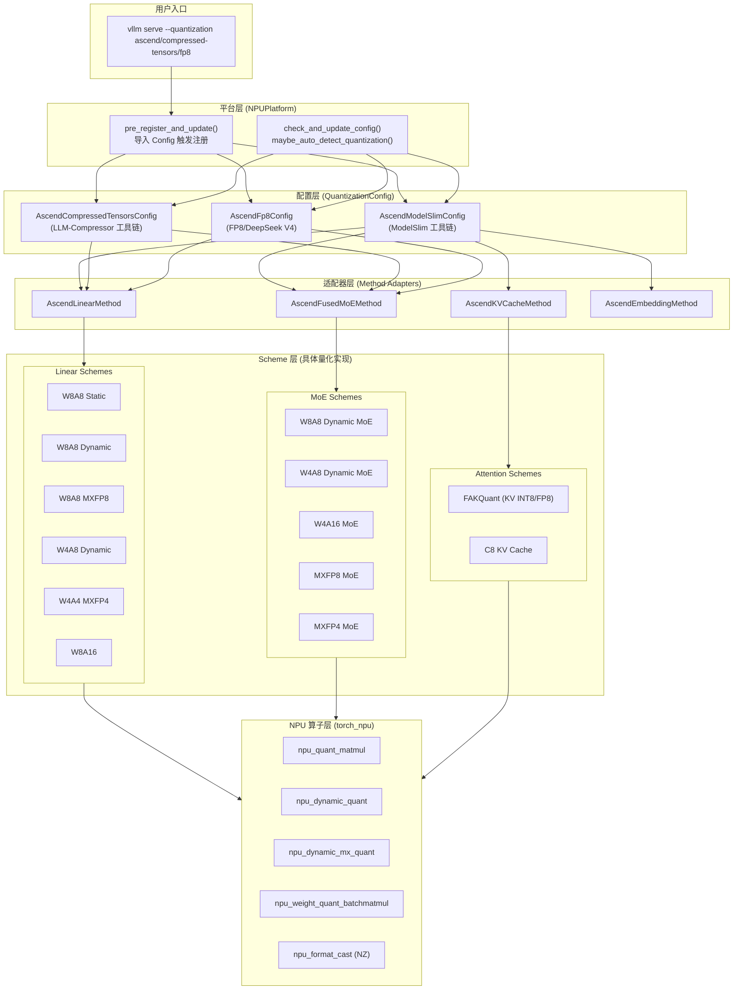
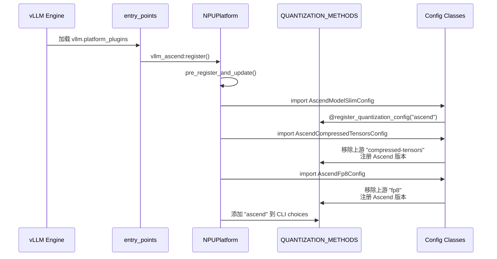
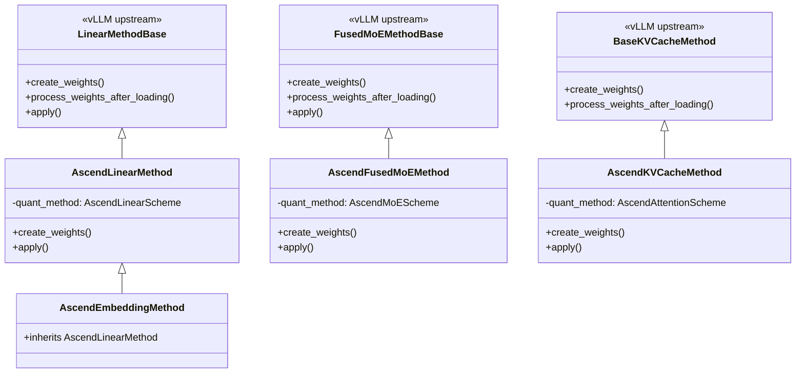
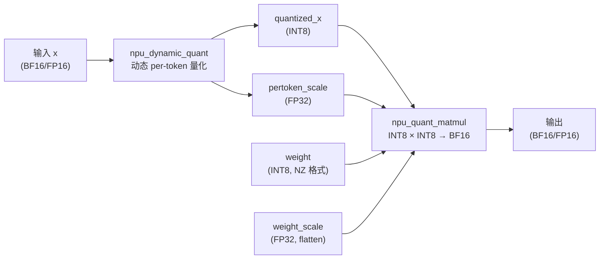
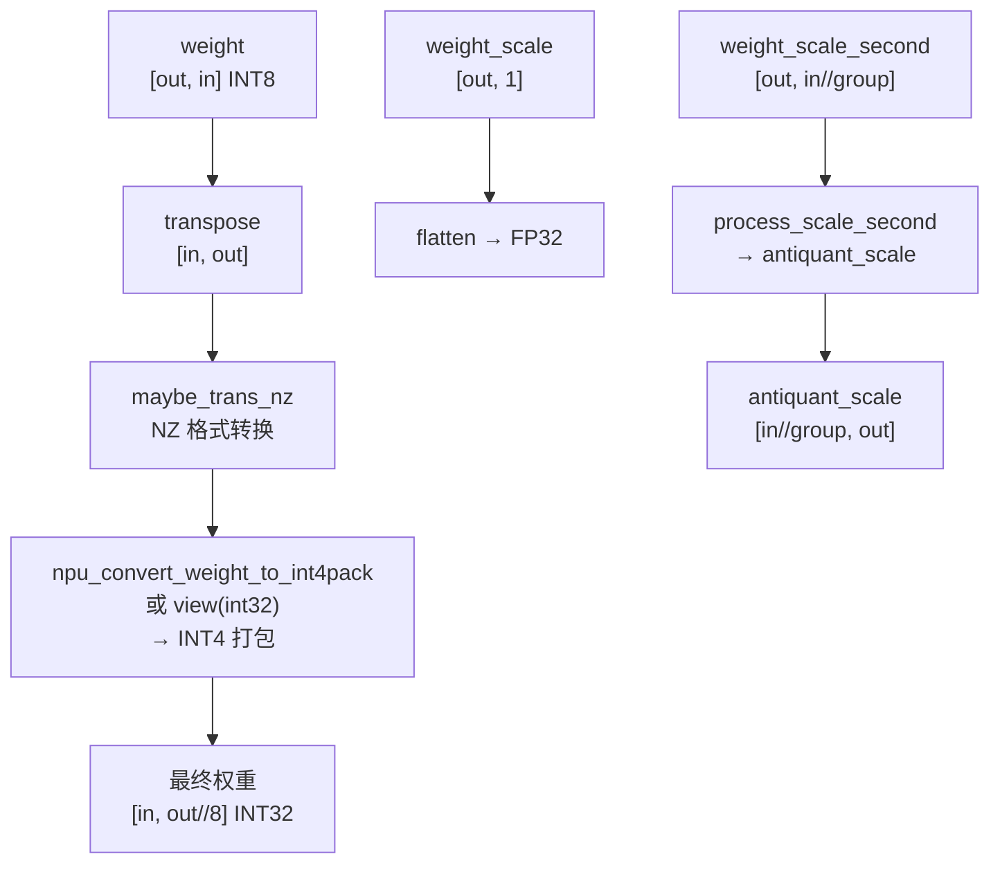
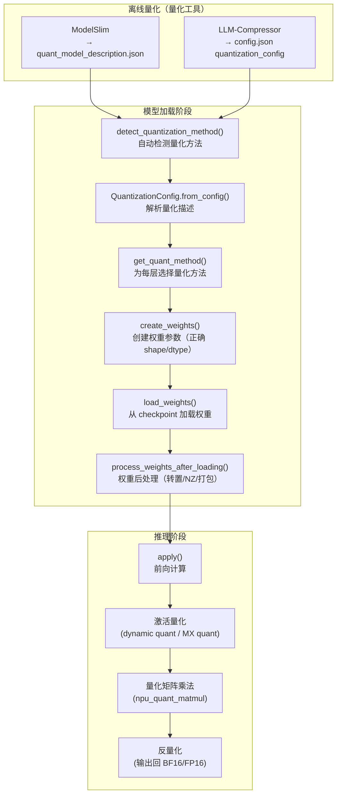

# vLLM Ascend 量化特性学习文档

> **文档版本**: 1.0
> **分析代码版本**: vllm-ascend main 分支（截至 2026-06）
> **最后更新**: 2026-06-16

---

## 文档概述

本文档深入分析 vllm-ascend 的量化推理系统，涵盖从插件注册、配置解析到各量化方法的 NPU 实现细节。

**目标读者**：
- 希望在 Ascend NPU 上部署量化模型的推理工程师
- 需要为 vllm-ascend 添加新量化方法或修复量化相关 bug 的开发者
- 希望理解 NPU 量化与 GPU 量化差异的系统架构师

**阅读指南**：
- 第一部分：了解量化系统的整体架构和 NPU 硬件约束
- 第二部分：理解量化配置如何通过插件机制替换上游 vLLM 实现
- 第三部分：深入各量化方法的 NPU 算子调用和权重处理流程
- 第四部分：查阅配置参数和使用示例

---

# 第一部分: 量化系统基础与背景

## 1.1 问题背景与动机

### 1.1.1 为什么需要量化

大语言模型（LLM）的推理面临两大瓶颈：**显存带宽**和**计算吞吐**。以 DeepSeek-V3 为例，其 671B 参数的 FP16 权重需要约 1.3TB 显存，远超单卡容量。量化通过降低权重和激活值的数值精度来解决这些问题：

- **减少显存占用**：W8A8 将权重从 FP16（2 字节）压缩到 INT8（1 字节），显存减半
- **提升计算吞吐**：Ascend 910B 的 INT8 矩阵乘法吞吐是 FP16 的 2 倍
- **降低带宽压力**：W4A16 将权重压缩到 4-bit，带宽需求降至 1/4

### 1.1.2 与上游 vLLM / GPU 版的差异

| 维度 | GPU (vLLM) | NPU (vllm-ascend) |
|------|-----------|-------------------|
| 量化配置注册 | `register_quantization_config` 直接注册 | 先移除上游注册，再用 Ascend 版本替换 |
| 量化算子 | CUTLASS / Marlin / Machete | `torch_npu.npu_quant_matmul` 系列 |
| 权重格式 | 标准行/列主序 | FRACTAL_NZ 分形格式（910B 专用） |
| 激活量化 | 静态/动态 per-token | 动态 per-token + Microscaling (MX) |
| KV Cache 量化 | FP8 / INT8 | INT8 (C8) + FAKQuant (Flash Attention Quant) |
| MoE 量化 | 标准 FusedMoE | 融合 MC2 通信 + EPLB 负载均衡 |
| 自动检测 | 无 | `maybe_auto_detect_quantization()` 自动识别 |
| 量化工具链 | LLM-Compressor / AutoGPTQ | ModelSlim + LLM-Compressor 双路径 |

> **NPU 差异**: Ascend NPU 的矩阵运算单元（Cube Unit）原生支持 INT8/INT4 量化矩阵乘法，但要求权重按 FRACTAL_NZ 分形格式存储。这与 GPU 的 CUTLASS 内核使用完全不同的数据布局。

## 1.2 核心概念与原理

### 1.2.1 量化基本思想

量化的核心公式为：

$$x_q = \text{round}\left(\frac{x}{s}\right) + z, \quad x_{dequant} = (x_q - z) \times s$$

其中 $s$ 为缩放因子（scale），$z$ 为零点偏移（offset/zero-point）。

**量化粒度**：
- **Per-tensor**：整个张量共享一组 (s, z)
- **Per-channel**：每个输出通道一组 (s, z)
- **Per-group**：每 G 个元素一组 (s, z)，G 通常为 32/128/256
- **Per-token**：每个 token 一组 (s, z)，用于动态激活量化

**Microscaling (MX)**：OCP 标准定义的分组量化格式，每组共享一个 E8M0 指数格式缩放因子，组内元素使用 FP8/FP4 低精度格式。Ascend 910C 原生支持 MX 格式硬件加速。

### 1.2.2 关键术语

| 术语 | 含义 |
|------|------|
| W8A8 | Weight 8-bit, Activation 8-bit |
| W4A16 | Weight 4-bit, Activation 16-bit (FP16/BF16) |
| W4A8 | Weight 4-bit, Activation 8-bit |
| MXFP8 | Microscaling FP8 (E4M3FN + E8M0 scale) |
| MXFP4 | Microscaling FP4 (E2M1FN_X2 + E8M0 scale) |
| FAKQuant | Flash Attention Quantization，KV Cache 量化 |
| C8 | INT8 KV Cache 量化 |
| NZ 格式 | FRACTAL_NZ，Ascend 分形矩阵存储格式 |
| ModelSlim | 华为 msModelSlim 量化工具 |
| LLM-Compressor | Neural Magic 的 LLM 量化工具（compressed-tensors 格式） |

## 1.3 整体架构

### 1.3.1 系统架构总览图



### 1.3.2 核心组件与职责

| 组件 | 文件路径 | 职责 |
|------|----------|------|
| `NPUPlatform` | `vllm_ascend/platform.py` | 注册量化方法、自动检测量化类型 |
| `AscendModelSlimConfig` | `vllm_ascend/quantization/modelslim_config.py` | 解析 ModelSlim 量化描述 JSON |
| `AscendCompressedTensorsConfig` | `vllm_ascend/quantization/compressed_tensors_config.py` | 解析 LLM-Compressor 格式 |
| `AscendFp8Config` | `vllm_ascend/quantization/fp8_config.py` | 解析 FP8/DeepSeek V4 格式 |
| `AscendLinearMethod` | `vllm_ascend/quantization/method_adapters.py` | Linear 层适配器 |
| `AscendFusedMoEMethod` | `vllm_ascend/quantization/method_adapters.py` | MoE 层适配器 |
| `AscendKVCacheMethod` | `vllm_ascend/quantization/method_adapters.py` | Attention KV Cache 适配器 |
| `_SCHEME_REGISTRY` | `vllm_ascend/quantization/methods/registry.py` | (quant_type, layer_type) → Scheme 映射 |

### 1.3.3 与 vLLM 上游的集成关系

vllm-ascend 的量化系统采用**替换式集成**策略：

1. **移除上游注册**：在模块导入时，将上游 vLLM 的 `compressed-tensors`、`fp8` 等方法从 `QUANTIZATION_METHODS` 列表中移除
2. **重新注册 Ascend 版本**：使用 `@register_quantization_config` 注册 Ascend 版本的 Config 类
3. **新增 ascend 方法**：注册上游不存在的 `ascend` 量化方法（ModelSlim 工具链）

```python
# 文件: vllm_ascend/quantization/compressed_tensors_config.py
def _remove_quantization_method():
    if COMPRESSED_TENSORS_METHOD in QUANTIZATION_METHODS:
        QUANTIZATION_METHODS.remove(COMPRESSED_TENSORS_METHOD)

_remove_quantization_method()

@register_quantization_config(COMPRESSED_TENSORS_METHOD)
class AscendCompressedTensorsConfig(QuantizationConfig):
    ...
```

---

# 第二部分: 插件集成机制分析

## 2.1 Entry Point 注册流程

vllm-ascend 通过 Python `entry_points` 机制注册为 vLLM 的平台插件：

```python
# 文件: setup.py
entry_points={
    "vllm.platform_plugins": ["ascend = vllm_ascend:register"],
}
```

量化配置的注册发生在 `NPUPlatform.pre_register_and_update()` 中：

```python
# 文件: vllm_ascend/platform.py
@classmethod
def pre_register_and_update(cls, parser=None):
    # 导入 Config 类触发 @register_quantization_config 装饰器
    if not is_310p():
        from vllm_ascend.quantization import (
            AscendCompressedTensorsConfig,
            AscendFp8Config,
            AscendModelSlimConfig,
        )
    # 将 "ascend" 添加到 --quantization 参数选项
    if parser is not None:
        quant_action = parser._option_string_actions.get("--quantization")
        if quant_action and hasattr(quant_action, "choices"):
            if ASCEND_QUANTIZATION_METHOD not in quant_action.choices:
                quant_action.choices.append(ASCEND_QUANTIZATION_METHOD)
```



## 2.2 自动量化检测

vllm-ascend 提供了自动检测量化方法的能力，在 `NPUPlatform.check_and_update_config()` 中调用：

```python
# 文件: vllm_ascend/platform.py
@classmethod
def check_and_update_config(cls, vllm_config):
    from vllm_ascend.quantization.utils import maybe_auto_detect_quantization
    if vllm_config.model_config is not None:
        maybe_auto_detect_quantization(vllm_config)
```

检测逻辑按优先级：

1. **ModelSlim**：检查 `quant_model_description.json` 是否存在
2. **LLM-Compressor**：检查 `config.json` 中 `quantization_config.quant_method == "compressed-tensors"`
3. **FP8**：检查 `quantization_config.quant_method == "fp8"`

```python
# 文件: vllm_ascend/quantization/utils.py
def detect_quantization_method(model, revision=None):
    # Case 1: ModelSlim
    modelslim_path = get_model_file(model, "quant_model_description.json", revision)
    if modelslim_path is not None:
        return ASCEND_QUANTIZATION_METHOD  # "ascend"

    # Case 2: LLM-Compressor / FP8
    config_path = get_model_file(model, "config.json", revision)
    if config_path is not None:
        quant_method = config.get("quantization_config", {}).get("quant_method", "")
        if quant_method == "compressed-tensors":
            return COMPRESSED_TENSORS_METHOD
        if quant_method == "fp8":
            return FP8_METHOD

    return None
```

> **关键洞察**: 自动检测功能使得用户无需手动指定 `--quantization` 参数。当模型目录中包含量化配置文件时，vllm-ascend 会自动选择对应的量化方法。

## 2.3 Scheme 注册表机制

vllm-ascend 使用自定义的 Scheme 注册表将 `(quant_type, layer_type)` 映射到具体的实现类：

```python
# 文件: vllm_ascend/quantization/methods/registry.py
_SCHEME_REGISTRY: dict[tuple[str, str], type[Any]] = {}

def register_scheme(quant_type: str, layer_type: str):
    def decorator(cls):
        key = (quant_type, layer_type)
        _SCHEME_REGISTRY[key] = cls
        return cls
    return decorator

def get_scheme_class(quant_type: str, layer_type: str):
    return _SCHEME_REGISTRY.get((quant_type, layer_type))
```

当前注册的 Scheme 完整列表：

| quant_type | layer_type | Scheme 类 | 文件 |
|-----------|-----------|-----------|------|
| `W8A8` | `linear` | `AscendW8A8LinearMethod` | `w8a8_static.py` |
| `W8A8_DYNAMIC` | `linear` | `AscendW8A8DynamicLinearMethod` | `w8a8_dynamic.py` |
| `W8A8_DYNAMIC` | `moe` | `AscendW8A8DynamicFusedMoEMethod` | `w8a8_dynamic.py` |
| `W8A8_MXFP8` | `linear` | `AscendW8A8MXFP8DynamicLinearMethod` | `w8a8_mxfp8.py` |
| `W8A8_MXFP8` | `moe` | `AscendW8A8MXFP8DynamicFusedMoEMethod` | `w8a8_mxfp8.py` |
| `W4A8_DYNAMIC` | `linear` | `AscendW4A8DynamicLinearMethod` | `w4a8.py` |
| `W4A8_DYNAMIC` | `moe` | `AscendW4A8DynamicFusedMoEMethod` | `w4a8.py` |
| `W4A16` | `moe` | `AscendW4A16FusedMoEMethod` | `w4a16.py` |
| `W4A4_MXFP4` | `linear` | `AscendW4A4MXFP4DynamicLinearMethod` | `w4a4_mxfp4.py` |
| `W4A4_MXFP4` | `moe` | `AscendW4A4MXFP4DynamicFusedMoEMethod` | `w4a4_mxfp4.py` |
| `FP8` | `ds_linear` | `AscendW8A8MXFP8DSDynamicLinearMethod` | `fp8.py` |
| `FP8` | `w4a8_moe` | `AscendW4A8MXFPDSDynamicFusedMoEMethod` | `fp8.py` |
| `FAKQuant` | `attention` | `AscendFAQuantAttentionMethod` | `kv_c8.py` |
| `INT8_DYNAMIC` | `attention` | `AscendSFAQuantAttentionMethod` | `kv_c8.py` |
| `W8A16` | `linear` | `AscendW8A16LinearMethod` | `w8a16.py` |

## 2.4 适配器层：连接 vLLM 与 Ascend Scheme

适配器类继承上游 vLLM 的基类，将调用委托给具体的 Ascend Scheme：



`AscendLinearMethod.create_weights()` 的核心逻辑展示了适配器如何调用 Scheme 的各参数获取方法：

```python
# 文件: vllm_ascend/quantization/method_adapters.py
class AscendLinearMethod(LinearMethodBase):
    def create_weights(self, layer, input_size_per_partition,
                       output_partition_sizes, input_size,
                       output_size, params_dtype, **extra_weight_attrs):
        # 1. 获取权重参数
        weight_dict = self.quant_method.get_weight(...)
        # 2. 获取 per-tensor 参数（如 input_scale）
        pertensor_dict = self.quant_method.get_pertensor_param(...)
        # 3. 获取 per-channel 参数（如 weight_scale）
        perchannel_dict = self.quant_method.get_perchannel_param(...)
        # 4. 获取 per-group 参数（如 weight_scale_second）
        pergroup_dict = self.quant_method.get_pergroup_param(...)
```

---

# 第三部分: 核心实现深度分析

## 3.1 Scheme 基类设计

所有量化 Scheme 继承自三个抽象基类之一：

```python
# 文件: vllm_ascend/quantization/methods/base.py
class AscendLinearScheme(ABC):
    @abstractmethod
    def get_weight(self, input_size, output_size, params_dtype) -> dict: ...
    def get_pertensor_param(self, params_dtype, **kwargs) -> dict: return {}
    def get_perchannel_param(self, output_size, params_dtype) -> dict: return {}
    def get_pergroup_param(self, input_size, output_size, params_dtype, ...) -> dict: return {}
    @abstractmethod
    def apply(self, layer, x, bias, tp_rank) -> torch.Tensor: ...
    def process_weights_after_loading(self, layer) -> None: return

class AscendMoEScheme(ABC):
    quant_type: QuantType = QuantType.NONE
    @abstractmethod
    def get_weight(self, num_experts, intermediate_size, hidden_sizes, dtype) -> dict: ...
    @abstractmethod
    def get_dynamic_quant_param(self, num_experts, intermediate_size, hidden_sizes, dtype) -> dict: ...
    @abstractmethod
    def apply(self, layer, x, router_logits, top_k, ...) -> torch.Tensor: ...
    def process_weights_after_loading(self, layer) -> None: return

class AscendAttentionScheme(ABC):
    def create_weights(self, layer) -> None: return
    def process_weights_after_loading(self, layer) -> None: return
    @abstractmethod
    def apply(self, layer, query, key, value, kv_cache, ...) -> torch.Tensor: ...
```

> **关键洞察**: 基类设计中 `get_pertensor_param`、`get_perchannel_param`、`get_pergroup_param` 都有默认空实现，子类只需覆写需要的方法。这种设计使得不同量化方法可以灵活声明所需的额外参数。

## 3.2 W8A8 Dynamic — 最常用的 NPU 量化方法

W8A8 Dynamic 是 vllm-ascend 中使用最广泛的量化方法，采用**动态 per-token 激活量化 + per-channel 权重量化**。

### 3.2.1 Linear 实现

```python
# 文件: vllm_ascend/quantization/methods/w8a8_dynamic.py
@register_scheme("W8A8_DYNAMIC", "linear")
class AscendW8A8DynamicLinearMethod(AscendLinearScheme):
    def get_weight(self, input_size, output_size, params_dtype):
        return {"weight": torch.empty(output_size, input_size, dtype=torch.int8)}

    def get_perchannel_param(self, output_size, params_dtype):
        return {
            "weight_scale": torch.empty(output_size, 1, dtype=params_dtype),
            "weight_offset": torch.empty(output_size, 1, dtype=params_dtype),
        }
```

**前向计算流程**：



```python
# 文件: vllm_ascend/quantization/methods/w8a8_dynamic.py
def apply(self, layer, x, bias=None, tp_rank=0):
    # Step 1: 动态量化激活值
    quantized_x, pertoken_scale = torch_npu.npu_dynamic_quant(x)

    # Step 2: 量化矩阵乘法
    output = torch_npu.npu_quant_matmul(
        quantized_x,
        layer.weight,           # INT8 权重 (NZ 格式)
        layer.weight_scale,     # per-channel scale (flatten)
        pertoken_scale=pertoken_scale,
        bias=bias,
        output_dtype=x.dtype,   # 反量化回原始精度
    )
    return output
```

**权重后处理**（`process_weights_after_loading`）：

```python
# 文件: vllm_ascend/quantization/methods/w8a8_dynamic.py
def process_weights_after_loading(self, layer):
    # 1. 转置权重: [out, in] -> [in, out]
    layer.weight.data = layer.weight.data.transpose(0, 1).contiguous()
    # 2. 转换为 NZ 格式（Ascend 分形矩阵格式，提升矩阵乘法效率）
    layer.weight.data = maybe_trans_nz(layer.weight.data)
    # 3. 展平 scale 和 offset
    layer.weight_scale.data = layer.weight_scale.data.flatten()
    layer.weight_offset.data = layer.weight_offset.data.flatten()
```

> **NPU 差异**: `maybe_trans_nz()` 将权重转换为 FRACTAL_NZ 格式。这是 Ascend 910B/C 的 Cube 单元要求的特殊矩阵布局，将矩阵切分为固定大小的分形块（fractal blocks），以最大化矩阵乘法的硬件利用率。

### 3.2.2 MoE 实现

W8A8 Dynamic MoE 在 Linear 基础上增加了专家路由和融合 MoE 计算：

```python
# 文件: vllm_ascend/quantization/methods/w8a8_dynamic.py
@register_scheme("W8A8_DYNAMIC", "moe")
class AscendW8A8DynamicFusedMoEMethod(AscendMoEScheme):
    quant_type: QuantType = QuantType.W8A8

    def apply(self, layer, x, router_logits, top_k, ...):
        # 1. 专家选择
        topk_weights, topk_ids = select_experts(
            hidden_states=x, router_logits=router_logits, top_k=top_k, ...)

        # 2. 通过 MoE 通信方法执行融合专家计算
        moe_comm_method = _EXTRA_CTX.moe_comm_method
        final_hidden_states = moe_comm_method.fused_experts(
            fused_experts_input=build_fused_experts_input(
                hidden_states=x,
                topk_weights=topk_weights,
                topk_ids=topk_ids,
                w1=[layer.w13_weight],
                w2=[layer.w2_weight],
                quant_type=self.quant_type,
                w1_scale=[layer.w13_weight_scale_fp32],
                w2_scale=[layer.w2_weight_scale],
                ...
            )
        )
        return final_hidden_states
```

MoE 权重后处理中，权重被转换为 NZ 格式并支持 EPLB（动态专家负载均衡）：

```python
# 文件: vllm_ascend/quantization/methods/w8a8_dynamic.py
def process_weights_after_loading(self, layer):
    layer.w13_weight.data = layer.w13_weight.data.transpose(1, 2).contiguous()
    layer.w2_weight.data = layer.w2_weight.data.transpose(1, 2).contiguous()
    # 转换为 NZ 格式
    layer.w13_weight.data = torch_npu.npu_format_cast(
        layer.w13_weight.data, ACL_FORMAT_FRACTAL_NZ)
    layer.w2_weight.data = torch_npu.npu_format_cast(
        layer.w2_weight.data, ACL_FORMAT_FRACTAL_NZ)

    # EPLB: 将权重拆分为 per-expert 列表
    if self.dynamic_eplb:
        layer.w13_weight_list = [w.clone() for w in layer.w13_weight.data.unbind(dim=0)]
        layer.w2_weight_list = [w.clone() for w in layer.w2_weight.data.unbind(dim=0)]
        del layer.w13_weight  # 释放原始张量
```

## 3.3 W8A8 Static — 静态量化

W8A8 Static 使用**静态 per-tensor 激活量化**，激活的 scale 在量化时离线计算并固化：

```python
# 文件: vllm_ascend/quantization/methods/w8a8_static.py
@register_scheme("W8A8", "linear")
class AscendW8A8LinearMethod(AscendLinearScheme):
    def get_pertensor_param(self, params_dtype, **kwargs):
        return {
            "input_scale": torch.empty(1, dtype=params_dtype),
            "input_offset": torch.empty(1, dtype=torch.int8),
        }

    def apply(self, layer, x, bias=None, tp_rank=0):
        if x.dtype != torch.int8:
            # 使用预计算的静态 scale 量化激活
            x = torch.ops.vllm.quantize(
                x,
                layer.aclnn_input_scale,
                layer.aclnn_input_scale_reciprocal,
                layer.aclnn_input_offset,
            )
        output = torch_npu.npu_quant_matmul(
            x, layer.weight, layer.deq_scale,
            bias=quant_bias, output_dtype=layer.params_dtype,
        )
        return output
```

**与 W8A8 Dynamic 的关键差异**：

| 维度 | W8A8 Static | W8A8 Dynamic |
|------|------------|-------------|
| 激活量化 | 静态 per-tensor（离线计算 scale） | 动态 per-token（运行时计算 scale） |
| 量化算子 | `torch.ops.vllm.quantize` | `torch_npu.npu_dynamic_quant` |
| 反量化 scale | `deq_scale = input_scale × weight_scale` | `pertoken_scale`（每 token 不同） |
| 精度 | 较低（全局 scale 无法适应 token 间差异） | 较高（每 token 独立 scale） |
| 性能 | 略高（无需运行时计算 scale） | 略低 |
| FlashComm2 | 支持（o_proj 量化后通信） | 不支持 |

## 3.4 W8A8 MXFP8 — Microscaling FP8 量化

MXFP8 使用 OCP Microscaling 标准，权重和激活都使用 FP8 (E4M3FN) 格式，每 32 个元素共享一个 E8M0 缩放因子：

```python
# 文件: vllm_ascend/quantization/methods/w8a8_mxfp8.py
@register_scheme("W8A8_MXFP8", "linear")
class AscendW8A8MXFP8DynamicLinearMethod(AscendLinearScheme):
    def get_weight(self, input_size, output_size, params_dtype):
        return {"weight": torch.empty(output_size, input_size, dtype=torch.float8_e4m3fn)}

    def get_pergroup_param(self, input_size, output_size, params_dtype, layer_type=None):
        return {
            "weight_scale": torch.empty(
                output_size, cdiv(input_size, self.group_size), dtype=torch.uint8
            )
        }

    def apply(self, layer, x, bias=None, tp_rank=0):
        # 动态 MX 量化：将 BF16 输入量化为 FP8 + E8M0 scale
        quantized_x, pertoken_scale = torch_npu.npu_dynamic_mx_quant(
            x, dst_type=torch.float8_e4m3fn)

        output = torch_npu.npu_quant_matmul(
            quantized_x, layer.weight, layer.weight_scale,
            scale_dtype=FLOAT8_E8M0FNU_DTYPE,           # E8M0 scale 类型
            pertoken_scale=pertoken_scale,
            pertoken_scale_dtype=FLOAT8_E8M0FNU_DTYPE,
            bias=bias, output_dtype=output_dtype,
            group_sizes=[1, 1, self.group_size],         # MX 分组大小
        )
        return output
```

**权重后处理中的 scale 重组**：

```python
# 文件: vllm_ascend/quantization/methods/w8a8_mxfp8.py
def process_weights_after_loading(self, layer):
    n_dim, k_dim = layer.weight_scale.data.shape
    # scale 重组: (n, k) -> (k//2, n, 2)
    layer.weight_scale.data = layer.weight_scale.data.reshape(n_dim, k_dim // 2, 2)
    # 权重转置: (n, k) -> (k, n)
    layer.weight.data = layer.weight.data.transpose(0, 1)
    layer.weight_scale.data = layer.weight_scale.data.transpose(0, 1)
```

> **NPU 差异**: MXFP8 的 scale 使用 E8M0FNU（8-bit 指数格式，无符号），这是 OCP Microscaling 标准定义的格式。Ascend 910C 硬件原生支持 MX 格式的矩阵乘法，无需软件反量化。

## 3.5 W4A8 Dynamic — 4-bit 权重 + 8-bit 激活

W4A8 将权重压缩到 4-bit，进一步减少显存占用。支持 ModelSlim 和 LLM-Compressor 两种工具链：

```python
# 文件: vllm_ascend/quantization/methods/w4a8.py
@register_scheme("W4A8_DYNAMIC", "linear")
class AscendW4A8DynamicLinearMethod(AscendLinearScheme):
    def apply(self, layer, x, bias=None, tp_rank=None):
        # 激活不量化（BF16），权重 INT4
        return torch_npu.npu_weight_quant_batchmatmul(
            x,
            layer.weight,
            antiquant_scale=layer.weight_scale_second.to(x.dtype),
            antiquant_group_size=self.group_size,
        )
```

**权重打包流程**（`process_weights_after_loading`）：



## 3.6 W4A16 — 4-bit 权重 + 16-bit 激活（MoE 专用）

W4A16 目前仅支持 MoE 层，使用 LLM-Compressor 工具链：

```python
# 文件: vllm_ascend/quantization/methods/w4a16.py
@register_scheme("W4A16", "moe")
class AscendW4A16FusedMoEMethod(AscendMoEScheme):
    quant_type: QuantType = QuantType.W4A16

    def __init__(self):
        self.num_bits = 4
        self.pack_factor = 8  # 8 个 INT4 打包到 1 个 INT32
```

权重加载后需要解包、转置、重新打包以适配 NPU 算子的数据布局：

```python
# 文件: vllm_ascend/quantization/methods/w4a16.py
def process_weights_after_loading(self, layer):
    # 1. 从 INT32 解包为 INT4
    unpacked_w13 = unpack_from_int32(layer.w13_weight_packed.data, ...)
    # 2. 转置为 NPU 算子要求的布局
    unpacked_w13 = unpacked_w13.transpose(1, 2).contiguous().int()
    # 3. 重新打包为 INT32
    layer.w13_weight_packed.data = pack_to_int32(unpacked_w13)
```

## 3.7 W4A4 MXFP4 — Microscaling FP4 量化

MXFP4 是最低精度的量化方法，权重和激活都使用 FP4 (E2M1FN_X2) 格式：

```python
# 文件: vllm_ascend/quantization/methods/w4a4_mxfp4.py
@register_scheme("W4A4_MXFP4", "linear")
class AscendW4A4MXFP4DynamicLinearMethod(AscendLinearScheme):
    def get_weight(self, input_size, output_size, params_dtype):
        # FP4: 两个 FP4 值打包到一个 uint8 中
        return {"weight": torch.empty(output_size, input_size // 2, dtype=torch.uint8)}

    def apply(self, layer, x, bias=None, tp_rank=0):
        # 动态 MX FP4 量化
        quantized_x, dynamic_scale = torch_npu.npu_dynamic_mx_quant(
            x, dst_type=torch_npu.float4_e2m1fn_x2, round_mode="round")

        output = torch_npu.npu_quant_matmul(
            quantized_x, layer.weight, layer.weight_scale,
            x1_dtype=torch_npu.float4_e2m1fn_x2,
            x2_dtype=torch_npu.float4_e2m1fn_x2,
            group_sizes=[1, 1, self.group_size],
            ...
        )
        return output
```

## 3.8 KV Cache 量化

### 3.8.1 C8 KV Cache (INT8)

C8 KV Cache 量化将 KV Cache 从 FP16/BF16 压缩到 INT8，显著减少 KV Cache 显存占用：

```python
# 文件: vllm_ascend/quantization/methods/kv_c8.py
class AscendC8KVCacheAttentionMethod(AscendAttentionScheme):
    def create_weights(self, layer):
        # 设置 KV Cache 为 INT8 存储
        if not self.is_kv_producer:
            layer.kv_cache_torch_dtype = torch.int8
        # 替换 attention 实现为 C8 版本
        if hasattr(layer, "impl"):
            from vllm_ascend.attention.attention_v1 import AscendC8AttentionBackendImpl
            layer.impl.__class__ = AscendC8AttentionBackendImpl
        # 注册 K/V 的 scale 和 offset 参数
        layer.k_cache_scale = torch.nn.Parameter(torch.ones(1, dtype=dtype), ...)
        layer.k_cache_offset = torch.nn.Parameter(torch.zeros(1, dtype=dtype), ...)
        layer.v_cache_scale = torch.nn.Parameter(torch.ones(1, dtype=dtype), ...)
        layer.v_cache_offset = torch.nn.Parameter(torch.zeros(1, dtype=dtype), ...)
```

### 3.8.2 FAKQuant (Flash Attention Quantization)

FAKQuant 是 MLA（Multi-head Latent Attention）模型专用的 KV Cache 量化方法，在 Attention 计算中直接处理量化后的 KV：

```python
# 文件: vllm_ascend/quantization/methods/kv_c8.py
@register_scheme("FAKQuant", "attention")
class AscendFAQuantAttentionMethod:
    def create_weights(self, layer):
        # 为 Q/K/V 分别创建量化 scale 和 offset
        params_dict = {
            "fa_q.scale": torch.empty((layer.num_heads, 1), dtype=dtype),
            "fa_k.scale": torch.empty((layer.num_kv_heads, 1), dtype=dtype),
            "fa_v.scale": torch.empty((layer.num_kv_heads, 1), dtype=dtype),
            "fa_q.offset": torch.empty((layer.num_heads, 1), dtype=torch.int8),
            "fa_k.offset": torch.empty((layer.num_kv_heads, 1), dtype=torch.int8),
            "fa_v.offset": torch.empty((layer.num_kv_heads, 1), dtype=torch.int8),
        }
```

## 3.9 量化方法对比总表

| 量化方法 | 权重精度 | 激活精度 | Scale 粒度 | NPU 算子 | 支持层类型 | 典型模型 |
|---------|---------|---------|-----------|---------|-----------|---------|
| W8A8 Static | INT8 | INT8 (静态 per-tensor) | per-channel (W) + per-tensor (A) | `npu_quant_matmul` | Linear | Qwen, LLaMA |
| W8A8 Dynamic | INT8 | INT8 (动态 per-token) | per-channel (W) + per-token (A) | `npu_quant_matmul` + `npu_dynamic_quant` | Linear, MoE | DeepSeek, Qwen-MoE |
| W8A8 MXFP8 | FP8 E4M3 | FP8 E4M3 (MX) | per-group (W) + per-token (A) | `npu_quant_matmul` + `npu_dynamic_mx_quant` | Linear, MoE | DeepSeek V3 |
| W4A8 Dynamic | INT4 | INT8 (动态 per-token) | per-group (W) + per-token (A) | `npu_weight_quant_batchmatmul` | Linear, MoE | Qwen, DeepSeek |
| W4A16 | INT4 | BF16/FP16 | per-group (W) | `npu_weight_quant_batchmatmul` | MoE | Kimi K2 |
| W4A4 MXFP4 | FP4 E2M1 | FP4 E2M1 (MX) | per-group (W) + per-token (A) | `npu_quant_matmul` + `npu_dynamic_mx_quant` | Linear, MoE | 实验性 |
| W8A16 | INT8 | BF16/FP16 | per-channel (W) | `npu_weight_quant_batchmatmul` | Linear | 通用 |
| FP8 (DS) | FP8 E4M3 | FP8 E4M3 (MX) | block 128×128 | `npu_quant_matmul` | Linear, MoE | DeepSeek V4 |
| C8 KV | — | INT8 (KV Cache) | per-head | Attention 后端内部 | Attention | Qwen3 等 |
| FAKQuant | — | INT8/FP8 (KV Cache) | per-head | Attention 后端内部 | Attention (MLA) | DeepSeek V3 |

## 3.10 NPU 特有优化

### 3.10.1 FRACTAL_NZ 格式

```python
# 文件: vllm_ascend/quantization/methods/w8a8_dynamic.py
from vllm_ascend.utils import maybe_trans_nz

# 将权重转换为 NZ 格式
layer.weight.data = maybe_trans_nz(layer.weight.data)
```

NZ 格式是 Ascend 910B/C 的 Cube 计算单元要求的矩阵存储格式。它将矩阵切分为 `16×16` 的分形块并按特定顺序排列，使得矩阵乘法可以直接在硬件上高效执行。

### 3.10.2 MC2 融合 Scale

当启用 MC2（MoE 融合通信）时，weight scale 需要转换为 INT64 表示：

```python
# 文件: vllm_ascend/quantization/methods/w8a8_dynamic.py
def scale_from_float_to_int64(scale):
    """将 FP32 scale 转换为 INT64 表示（位模式重解释）"""
    scale = torch.from_numpy(
        np.frombuffer(scale.cpu().to(torch.float32).numpy().tobytes(),
                      dtype=np.int32).astype(np.int64)
    ).to(scale.device)
    return scale
```

### 3.10.3 FlashComm2 量化通信融合

W8A8 Static 支持在 o_proj 层将量化与 AllReduce 通信融合：

```python
# 文件: vllm_ascend/quantization/methods/w8a8_static.py
enable_flashcomm2_quant_comm = comm_fn is not None and (
    "o_proj" in layer.prefix or "out_proj" in layer.prefix)
if enable_flashcomm2_quant_comm:
    # 先量化，再通信（INT8 通信量是 BF16 的一半）
    quant_x = torch.ops.vllm.quantize(x, ...)
    x = comm_fn(quant_x)  # AllReduce on INT8
```

> **性能提示**: FlashComm2 在 o_proj 层先量化到 INT8 再执行 AllReduce，通信量减半，在多卡推理场景下可显著提升吞吐。

---

# 第四部分: 配置与使用指南

## 4.1 量化方法选择

### 4.1.1 使用 ModelSlim 量化的模型

```bash
# 自动检测（推荐）
vllm serve /path/to/quantized/model

# 手动指定
vllm serve /path/to/quantized/model --quantization ascend
```

### 4.1.2 使用 LLM-Compressor 量化的模型

```bash
# 自动检测
vllm serve /path/to/compressed_model

# 手动指定
vllm serve /path/to/compressed_model --quantization compressed-tensors
```

### 4.1.3 FP8 / DeepSeek V4 模型

```bash
vllm serve /path/to/fp8_model --quantization fp8
```

## 4.2 支持的模型与量化方法矩阵

| 模型 | W8A8 Dynamic | W8A8 Static | W8A8 MXFP8 | W4A8 | W4A16 | W4A4 MXFP4 | C8 KV |
|------|:-----------:|:----------:|:----------:|:----:|:-----:|:----------:|:-----:|
| DeepSeek V2/V3 | ✅ | ✅ | ✅ | ✅ | — | — | ✅ |
| DeepSeek V4 | — | — | ✅ | — | — | ✅ | ✅ |
| Qwen2.5 | ✅ | ✅ | — | ✅ | — | — | ✅ |
| Qwen3 MoE | ✅ | — | — | ✅ | ✅ | — | ✅ |
| Kimi K2 | — | — | — | — | ✅ | — | — |
| GLM-4 MoE | ✅ | — | — | ✅ | — | — | — |

## 4.3 相关环境变量与配置参数

| 参数/环境变量 | 类型 | 默认值 | 说明 |
|-------------|------|--------|------|
| `--quantization` | str | None | 量化方法名称：`ascend`/`compressed-tensors`/`fp8` |
| `VLLM_ASCEND_ENABLE_NZ` | bool | True (910B) | 是否启用 NZ 格式转换 |
| `VLLM_ASCEND_ENABLE_FUSED_MC2` | int | 0 | 启用 MC2 融合 MoE 通信（1=启用） |
| `AscendConfig.eplb_config.dynamic_eplb` | bool | False | 启用动态专家负载均衡 |
| `AscendConfig.multistream_overlap_gate` | bool | False | 多流重叠 gate 计算 |
| `AscendConfig.flashcomm2_oproj_tensor_parallel_size` | int | 1 | FlashComm2 o_proj TP 大小 |
| `quant_description["group_size"]` | int | 32/128/256 | 量化分组大小 |
| `quant_description["version"]` | str | "0" | ModelSlim 量化版本（"1.0.0" 为新版本） |

## 4.4 性能调优建议

1. **优先使用 W8A8 Dynamic**：在精度和性能之间取得最佳平衡，是大多数场景的首选
2. **MoE 模型启用 MC2**：设置 `VLLM_ASCEND_ENABLE_FUSED_MC2=1`，将 AllToAll 通信与专家计算融合
3. **启用 EPLB**：对于 MoE 模型，动态专家负载均衡可避免热点专家瓶颈
4. **KV Cache 量化**：长序列场景下启用 C8 KV Cache 量化，KV Cache 显存减半
5. **FlashComm2**：多卡推理时启用 FlashComm2，o_proj 的 AllReduce 通信量减半

## 4.5 已知限制与注意事项

- **W4A16 仅支持 MoE 层**：当前 W4A16 实现仅适用于 MoE 模型的专家层
- **NZ 格式限制**：仅 Ascend 910B/C 支持 NZ 格式，310P 不支持
- **MXFP8/MXFP4 需要 910C**：Microscaling 格式需要 Ascend 910C 硬件支持
- **W8A8 Dynamic MoE 的 weight dim 限制**：`npu_quant_matmul` 不支持 weight dim ≥ 65536，需要 chunk 处理
- **ModelSlim 版本兼容**：`version == "1.0.0"` 的新版权重布局与旧版不兼容
- **RL 场景权重重载**：MXFP8 的 `process_weights_after_loading` 支持多次调用，需配合 `restore_weights_for_rl_loading()` 使用

---

# 附录

## A. 关键代码位置索引

| 组件 | 文件路径 |
|------|----------|
| 量化模块入口 | `vllm_ascend/quantization/__init__.py` |
| ModelSlim 配置 | `vllm_ascend/quantization/modelslim_config.py` |
| LLM-Compressor 配置 | `vllm_ascend/quantization/compressed_tensors_config.py` |
| FP8 配置 | `vllm_ascend/quantization/fp8_config.py` |
| 方法适配器 | `vllm_ascend/quantization/method_adapters.py` |
| Scheme 注册表 | `vllm_ascend/quantization/methods/registry.py` |
| Scheme 基类 | `vllm_ascend/quantization/methods/base.py` |
| W8A8 Dynamic | `vllm_ascend/quantization/methods/w8a8_dynamic.py` |
| W8A8 Static | `vllm_ascend/quantization/methods/w8a8_static.py` |
| W8A8 MXFP8 | `vllm_ascend/quantization/methods/w8a8_mxfp8.py` |
| W4A8 Dynamic | `vllm_ascend/quantization/methods/w4a8.py` |
| W4A16 MoE | `vllm_ascend/quantization/methods/w4a16.py` |
| W4A4 MXFP4 | `vllm_ascend/quantization/methods/w4a4_mxfp4.py` |
| W8A16 | `vllm_ascend/quantization/methods/w8a16.py` |
| FP8 (DeepSeek) | `vllm_ascend/quantization/methods/fp8.py` |
| KV Cache C8 / FAKQuant | `vllm_ascend/quantization/methods/kv_c8.py` |
| W8A8 PDMix | `vllm_ascend/quantization/methods/w8a8_pdmix.py` |
| W4A4 FlatQuant | `vllm_ascend/quantization/methods/w4a4_flatquant.py` |
| W4A4 LAOS | `vllm_ascend/quantization/methods/w4a4_laos_dynamic.py` |
| 量化类型枚举 | `vllm_ascend/quantization/quant_type.py` |
| 量化参数解析 | `vllm_ascend/quantization/quant_parser.py` |
| 自动检测工具 | `vllm_ascend/quantization/utils.py` |
| 平台注册 | `vllm_ascend/platform.py` |
| Entry Point | `setup.py` |

## B. 术语表

| 术语 | 全称 | 说明 |
|------|------|------|
| NZ | FRACTAL_NZ | Ascend 分形矩阵存储格式 |
| MX | Microscaling | OCP 微缩放量化标准 |
| MXFP8 | Microscaling FP8 | MX 格式的 FP8 量化 |
| MXFP4 | Microscaling FP4 | MX 格式的 FP4 量化 |
| E4M3FN | — | FP8 格式：4-bit 指数 + 3-bit 尾数 + FN（finite, no NaN） |
| E8M0FNU | — | FP8 指数格式：8-bit 指数 + 0-bit 尾数（用于 MX scale） |
| E2M1FN_X2 | — | FP4 格式：2-bit 指数 + 1-bit 尾数，两个值打包存储 |
| EPLB | Expert-Level Load Balancing | 动态专家级负载均衡 |
| MC2 | — | Ascend MoE 融合通信算子 |
| FAKQuant | Flash Attention Quantization | Flash Attention 量化（MLA 模型 KV Cache） |
| ModelSlim | msModelSlim | 华为模型量化工具 |
| compressed-tensors | — | LLM-Compressor 的量化格式名称 |
| Scheme | — | 量化方案，定义权重格式和前向计算逻辑 |
| Adapter | — | 适配器，连接 vLLM 框架和 Ascend Scheme |

## C. 量化执行流程总览



## D. 量化执行流程具体示例（以 Qwen3-30B W8A8 为例）

以 `vllm serve /path/to/Qwen3-30B-W8A8 --quantization ascend` 为例，完整流程分为模型加载（一次性）和推理（每次请求）两个阶段。

### D.1 阶段一：模型加载（启动时，一次性）

```
用户执行 vllm serve 命令
    │
    ▼
① detect_quantization_method()
   扫描模型目录，发现 quant_model_description.json
   → 返回 "ascend"
    │
    ▼
② AscendModelSlimConfig.from_config()
   读取 quant_model_description.json，得到每层的量化类型：
   {
     "model.layers.0.self_attn.qkv_proj.weight": "W8A8_DYNAMIC",
     "model.layers.0.self_attn.o_proj.weight": "W8A8_DYNAMIC",
     "model.layers.0.mlp.experts.0.gate_proj.weight": "W8A8_DYNAMIC",
     "model.layers.0.mlp.experts.0.down_proj.weight": "W8A8_DYNAMIC",
     "lm_head.weight": "FLOAT"   ← lm_head 不量化
   }
    │
    ▼
③ get_quant_method() — 为每个 nn.Module 选择量化方法
   遍历模型所有层，根据层类型 + 量化描述匹配：

   qkv_proj (ColumnParallelLinear)
     → get_scheme_class("W8A8_DYNAMIC", "linear")
     → AscendW8A8DynamicLinearMethod
     → 包装为 AscendLinearMethod(scheme)

   FusedMoE (256个专家融合层)
     → get_scheme_class("W8A8_DYNAMIC", "moe")
     → AscendW8A8DynamicFusedMoEMethod
     → 包装为 AscendFusedMoEMethod(scheme)

   lm_head (LinearBase, 标记为 "FLOAT")
     → is_layer_skipped_ascend() == True
     → AscendUnquantizedLinearMethod（不量化）
    │
    ▼
④ create_weights() — 创建正确 shape/dtype 的参数占位

   以 qkv_proj 为例（hidden=2048, heads=16, kv_heads=4, head_dim=128）：
   scheme.get_weight() 返回：
     weight: torch.empty(2560, 2048, dtype=torch.int8)   ← INT8 而非 BF16
   scheme.get_perchannel_param() 返回：
     weight_scale:  torch.empty(2560, 1, dtype=torch.bfloat16)
     weight_offset: torch.empty(2560, 1, dtype=torch.bfloat16)

   以 FusedMoE 为例（256 experts, intermediate=512, hidden=2048）：
   scheme.get_weight() 返回：
     w13_weight: torch.empty(256, 1024, 2048, dtype=torch.int8)
     w2_weight:  torch.empty(256, 2048, 512,  dtype=torch.int8)
   scheme.get_dynamic_quant_param() 返回：
     w13_weight_scale: torch.empty(256, 1024, 1, dtype=torch.float32)
     w2_weight_scale:  torch.empty(256, 2048, 1, dtype=torch.float32)
    │
    ▼
⑤ load_weights() — 从 safetensors 加载 INT8 权重到上面创建的参数中
    │
    ▼
⑥ process_weights_after_loading() — 权重后处理（关键步骤！）

   qkv_proj:
     weight [2560, 2048] INT8
       → transpose → [2048, 2560]
       → maybe_trans_nz → NZ 分形格式
     weight_scale [2560, 1] → flatten → [2560]

   FusedMoE:
     w13_weight [256, 1024, 2048] INT8
       → transpose(1,2) → [256, 2048, 1024]
       → npu_format_cast(NZ) → NZ 格式
     w13_weight_scale → flatten → FP32
```

### D.2 阶段二：推理（每次请求）

用户输入 prompt：`"你好，请介绍一下自己"`

```
Tokenizer 编码 → token IDs: [108386, 3837, 99489, ...]
    │
    ▼
Embedding 查表 → hidden_states: [num_tokens, 2048] BF16
    │
    ▼
╔══════════════════════════════════════════════════╗
║  Layer 0 Self-Attention — qkv_proj (Linear)     ║
╠══════════════════════════════════════════════════╣
║                                                  ║
║  x: [num_tokens, 2048] BF16                     ║
║       │                                          ║
║       ▼                                          ║
║  npu_dynamic_quant(x)                            ║
║       │                                          ║
║       ├──→ quantized_x: [num_tokens, 2048] INT8 ║
║       └──→ pertoken_scale: [num_tokens, 1] FP32 ║
║              │                                   ║
║              ▼                                   ║
║  npu_quant_matmul(                               ║
║      quantized_x,     # INT8 激活                ║
║      layer.weight,    # INT8 权重 (NZ格式)       ║
║      layer.weight_scale,  # FP32 per-channel     ║
║      pertoken_scale,  # FP32 per-token           ║
║      output_dtype=BF16   # 反量化回 BF16         ║
║  )                                               ║
║       │                                          ║
║       ▼                                          ║
║  QKV: [num_tokens, 2560] BF16                   ║
║       │                                          ║
║       ▼                                          ║
║  Attention 计算 (Paged Attention)                ║
║  → 写入 KV Cache（如果启用 C8 则 INT8 存储）     ║
║       │                                          ║
║       ▼                                          ║
║  o_proj: 同样的 dynamic_quant → quant_matmul     ║
║       │                                          ║
║       ▼                                          ║
║  attn_output: [num_tokens, 2048] BF16           ║
╚══════════════════════════════════════════════════╝
    │
    ▼  残差连接: x = x + attn_output
    │
╔══════════════════════════════════════════════════╗
║  Layer 0 MoE FFN — FusedMoE                     ║
╠══════════════════════════════════════════════════╣
║                                                  ║
║  x: [num_tokens, 2048] BF16                     ║
║       │                                          ║
║       ▼                                          ║
║  router(x) → router_logits: [num_tokens, 256]   ║
║       │                                          ║
║       ▼                                          ║
║  select_experts(top_k=8)                         ║
║       ├──→ topk_ids: [num_tokens, 8]             ║
║       │    (选中哪 8 个专家)                      ║
║       └──→ topk_weights: [num_tokens, 8]         ║
║            (专家权重)                             ║
║              │                                   ║
║              ▼                                   ║
║  moe_comm_method.fused_experts()                 ║
║  ┌──────────────────────────────────────────┐    ║
║  │ AllToAll: 按专家分发 token 到各 NPU 卡   │    ║
║  │                                          │    ║
║  │ 对每个专家执行:                           │    ║
║  │   npu_dynamic_quant(x) → INT8            │    ║
║  │   npu_grouped_matmul(                    │    ║
║  │     INT8_x, INT8_w13, scale) → gate+up   │    ║
║  │   SiLU(gate) ⊙ up → intermediate         │    ║
║  │   npu_dynamic_quant(intermediate) → INT8 │    ║
║  │   npu_grouped_matmul(                    │    ║
║  │     INT8_x, INT8_w2, scale) → output     │    ║
║  │                                          │    ║
║  │ AllToAll: 将结果收回到原始 NPU 卡        │    ║
║  └──────────────────────────────────────────┘    ║
║       │                                          ║
║       ▼                                          ║
║  moe_output: [num_tokens, 2048] BF16            ║
╚══════════════════════════════════════════════════╝
    │
    ▼  残差连接: x = x + moe_output
    │
    ▼  重复 48 层...
    │
    ▼
lm_head (FLOAT, 不量化): [num_tokens, 2048] → [num_tokens, vocab_size]
    │
    ▼
Sampler → 生成下一个 token → 循环直到结束
```

> **关键理解**: 量化发生在**每一次矩阵乘法**中。每个 Linear/MoE 层的 `apply()` 方法内部都执行三步：量化激活 → 量化矩阵乘 → 反量化输出。模型权重在加载时就已经是 INT8/INT4 格式了（阶段一），推理时只需对激活值做动态量化。